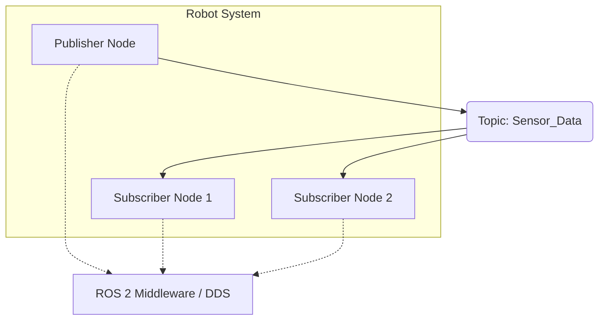

# Chapter 1.2: ROS 2 Core Concepts: Nodes, Topics, Services

# Chapter 1.2: ROS 2 Core Concepts: Nodes, Topics, Services

ROS 2 provides a powerful and flexible framework for building robot applications by defining several core concepts that facilitate communication and organization. Understanding these concepts is fundamental to developing robust robotic systems.

### Nodes: The Workhorses of ROS 2
In ROS 2, a **Node** is an executable process that performs a specific task. Think of a node as an individual program or module within your robot's software system. For example, you might have one node for reading data from a camera, another for controlling motors, and yet another for performing navigation calculations.

*   **Modularity:** Nodes promote modularity, allowing developers to break down complex robot behaviors into smaller, manageable, and reusable components.
*   **Encapsulation:** Each node can be developed, tested, and deployed independently, making debugging and maintenance easier.
*   **Communication:** Nodes communicate with each other using various mechanisms provided by ROS 2, primarily Topics, Services, and Actions.

### Topics: Asynchronous Data Streaming (Publish/Subscribe)
**Topics** are the most common way for nodes to exchange data in ROS 2, implementing a **publish/subscribe** communication model.

*   **Publishers:** A node that sends data to a topic is called a publisher. It broadcasts messages without knowing which (if any) nodes are listening.
*   **Subscribers:** A node that receives data from a topic is called a subscriber. It listens for messages on a specific topic.
*   **One-to-Many:** Topics support one-to-many communication; a single publisher can send data to multiple subscribers, and multiple publishers can send data to a single topic (though this is less common).
*   **Message Types:** All messages transmitted over a topic must conform to a predefined message type (e.g., `sensor_msgs/msg/Image` for camera data, `std_msgs/msg/String` for simple text). This ensures data consistency.
*   **Asynchronous:** Communication via topics is asynchronous and non-blocking, meaning the publisher doesn't wait for a response from the subscriber. This is ideal for continuous data streams like sensor readings, joint states, or velocity commands.

### Services: Synchronous Request/Response Interaction
**Services** provide a **request/response** communication model, allowing nodes to make synchronous calls to other nodes and wait for a result.

*   **Client:** A node that requests a service is called a client.
*   **Server:** A node that provides a service is called a server. It waits for requests from clients and sends back a response.
*   **Synchronous:** Unlike topics, services are synchronous and blocking. The client sends a request and waits until it receives a response (or a timeout occurs).
*   **Use Cases:** Services are suitable for operations that require an immediate result, such as triggering a specific action (e.g., "take a picture," "move arm to position X"), querying a database, or performing a complex calculation.

### Actions: Long-Running Goal-Oriented Tasks
**Actions** are a more complex communication primitive built on top of topics and services, designed for **long-running, goal-oriented tasks**.

*   **Goal:** A client sends a goal to an action server (e.g., "navigate to X, Y").
*   **Feedback:** The action server provides continuous feedback as it progresses towards the goal (e.g., "current position," "progress percentage").
*   **Result:** Once the goal is achieved (or fails), the action server sends a final result back to the client.
*   **Preemptable:** Actions are preemptable, meaning a client can cancel a goal that is currently being executed by the server.
*   **Use Cases:** Ideal for tasks like navigation, complex manipulation sequences, or any operation that takes a significant amount of time and for which continuous feedback is desirable.

These core concepts—Nodes, Topics, Services, and Actions—form the backbone of communication and control in ROS 2, enabling the creation of highly distributed, modular, and robust robotic applications.
## Learning objectives: Implement basic ROS 2 communication

### Understanding Publish/Subscribe Communication

One of the fundamental communication patterns enabled by robotic middleware is the **publish/subscribe model**. This pattern allows different components of a robot (called "nodes" in ROS) to send and receive messages without direct knowledge of each other. A "publisher" node sends messages on a specific "topic," and any "subscriber" node interested in that data can listen to that topic. This decouples the senders from the receivers, making the system more flexible and modular.



This diagram illustrates how a Publisher Node sends data (e.g., sensor readings) to a Topic, which is then received by multiple Subscriber Nodes through the ROS 2 Middleware (DDS).

## Installation Guide: ROS 2 Humble on Ubuntu 22.04

This section provides a verified, step-by-step guide to installing ROS 2 Humble Hawksbill on Ubuntu 22.04 (Jammy Jellyfish). Following these instructions carefully will ensure a successful setup.

### 1. Set Up Your Locale

It is recommended to have a UTF-8 locale. If you are in a minimal environment, you might need to uncomment locale generation in `/etc/locale.gen` and then generate the locale.

```bash
locale  # check for UTF-8

sudo apt update && sudo apt install locales
sudo locale-gen en_US en_US.UTF-8
sudo update-locale LC_ALL=en_US.UTF-8 LANG=en_US.UTF-8
export LANG=en_US.UTF-8

locale  # verify settings
```

### 2. Add the ROS 2 APT Repository

First, ensure your system is up-to-date and install necessary utilities:

```bash
sudo apt update && sudo apt install -y software-properties-common apt-transport-https ca-certificates curl
```

Now, add the GPG key for the ROS 2 repository:

```bash
curl -sSL https://raw.githubusercontent.com/ros/rosdistro/master/ros.key -o /usr/share/keyrings/ros-archive-keyring.gpg
```

Then, add the repository to your sources list:

```bash
echo "deb [arch=$(dpkg --print-architecture) signed-by=/usr/share/keyrings/ros-archive-keyring.gpg] http://packages.ros.org/ros2/ubuntu $(. /etc/os-release && echo UBUNTU_CODENAME) main" | sudo tee /etc/apt/sources.list.d/ros2.list > /dev/null
```

### 3. Install ROS 2 Packages

Update your package list again after adding the new repository:

```bash
sudo apt update
```

Install the ROS 2 Humble Desktop environment (includes ROS, rqt, rviz, robot_state_publisher, and generic libraries):

```bash
sudo apt install -y ros-humble-desktop
```

For development tools, you might also want to install:

```bash
sudo apt install -y ros-humble-ros-base ros-dev-tools
```

### 4. Source the ROS 2 Setup Script

To use ROS 2 commands, you need to source its setup script. It's recommended to add this to your `~/.bashrc` for automatic sourcing on new terminals:

```bash
echo "source /opt/ros/humble/setup.bash" >> ~/.bashrc
source ~/.bashrc
```

If you are using Zsh, you would add it to `~/.zshrc` instead:

```bash
echo "source /opt/ros/humble/setup.zsh" >> ~/.zshrc
source ~/.zshrc
```

### 5. Install argcomplete (Optional but Recommended)

For autocompletion of ROS 2 commands:

```bash
sudo apt install -y python3-pip
pip install -U argcomplete
```

Then, enable it for your shell (for Bash):

```bash
activate-global-python-argcomplete
```

**(End of Installation Guide)**

## Verification & First Commands

After successfully installing ROS 2 Humble, it's crucial to verify that everything is working as expected. This hands-on exercise will guide you through basic ROS 2 commands and demonstrate the publish/subscribe communication model.

### 1. Verify ROS 2 Installation with `ros2 doctor`

The `ros2 doctor` command is a helpful tool to check the health of your ROS 2 environment. It performs a series of checks and reports any potential issues.

**Command:**

```bash
ros2 doctor
```

**Expected Output:**

You should see a report indicating "All OK" or similar success messages. Any warnings or errors will be highlighted, guiding you towards troubleshooting. For a fresh installation, this should be mostly clean.

```text
# Example of a successful output (may vary slightly)
All OK :)
```

### 2. Run a Simple Publish/Subscribe Example

Let's use the `demo_nodes_cpp` package, which contains basic talker (publisher) and listener (subscriber) examples.

**Step A: Start the Listener (Subscriber)**

Open a *new terminal* (remember to source your ROS 2 setup if not in `.bashrc`):

```bash
source /opt/ros/humble/setup.bash # if not in .bashrc
ros2 run demo_nodes_cpp listener
```

**Expected Output:**

The listener terminal should start waiting for messages and eventually print received messages:

```text
[INFO] [minimal_listener]: I heard: "Hello World 0"
[INFO] [minimal_listener]: I heard: "Hello World 1"
[INFO] [minimal_listener]: I heard: "Hello World 2"
...
```

**Step B: Start the Talker (Publisher)**

Open *another new terminal* (again, source ROS 2 setup):

```bash
source /opt/ros/humble/setup.bash # if not in .bashrc
ros2 run demo_nodes_cpp talker
```

**Expected Output:**

The talker terminal should show it's publishing messages, and concurrently, your listener terminal (from Step A) should begin displaying these messages.

```text
[INFO] [minimal_talker]: Publishing: "Hello World 0"
[INFO] [minimal_talker]: Publishing: "Hello World 1"
[INFO] [minimal_talker]: Publishing: "Hello World 2"
...
```

### 3. Inspect ROS 2 Nodes and Topics

While the talker and listener are running, open a *third terminal* (source ROS 2 setup) to inspect the ROS 2 graph.

**List active ROS 2 nodes:**

```bash
ros2 node list
```

**Expected Output:**

You should see the talker and listener nodes:

```bash
/listener
/talker
```

**List active ROS 2 topics:**

```bash
ros2 topic list
```

**Expected Output:**

You should see the `/topic` that the talker is publishing to:

```bash
/parameter_events
/rosout
/topic
```

**Echo messages on the topic:**

```bash
ros2 topic echo /topic
```

**Expected Output:**

This command will display the messages being published on `/topic` in real-time, confirming the communication:

```json
---
data: Hello World 23
---
data: Hello World 24
---
data: Hello World 25
...
```

By successfully completing these steps, you have confirmed your ROS 2 Humble installation is functional and have witnessed basic ROS 2 communication in action!

## Common Pitfalls & Solutions

Even with a detailed guide, installation can sometimes present challenges. Here are some common pitfalls encountered during ROS 2 Humble installation on Ubuntu 22.04 and their corresponding solutions.

### 1. Locale Issues

**Pitfall**: The `locale` command shows warnings, or ROS 2 commands fail with locale-related errors (e.g., "invalid character sequence").
**Solution**: Ensure your locale is correctly set to UTF-8. Revisit "1. Set Up Your Locale" section in the Installation Guide and execute the commands carefully. Specifically, check `/etc/locale.gen` to ensure `en_US.UTF-8 UTF-8` is uncommented, then run `sudo locale-gen`, and finally `sudo update-locale LC_ALL=en_US.UTF-8 LANG=en_US.UTF-8` and `export LANG=en_US.UTF-8`.

### 2. Repository Key/Source List Errors

**Pitfall**: `sudo apt update` fails with GPG errors (e.g., "NO_PUBKEY") or the ROS 2 repository is not found.
**Solution**: This usually means the GPG key or the repository source list was not added correctly.
*   **GPG Key**: Double-check the `curl` command for adding the `ros.key`. Ensure there are no typos and that the key is written to `/usr/share/keyrings/ros-archive-keyring.gpg`.
*   **Source List**: Verify the `echo "deb ..."` command. Ensure it correctly pipes the repository line into `/etc/apt/sources.list.d/ros2.list`. You can inspect the file's content with `cat /etc/apt/sources.list.d/ros2.list`.

### 3. Package Not Found Errors

**Pitfall**: `sudo apt install ros-humble-desktop` (or other ROS 2 packages) results in "Unable to locate package" errors.
**Solution**: This typically means your `apt` package list is out of date or the ROS 2 repository was not added correctly.
1.  **Update**: Run `sudo apt update` again to ensure your package list is refreshed.
2.  **Verify Repository**: Re-check step "2. Add the ROS 2 APT Repository" to confirm the repository was added correctly.
3.  **Typos**: Ensure there are no typos in the package names (e.g., `ros-humble-desktop`).

### 4. Sourcing Issues (Commands Not Found)

**Pitfall**: After installation, commands like `ros2 run` or `ros2 node list` are not found.
**Solution**: This means your shell environment has not been correctly set up to recognize ROS 2 commands.
1.  **Source Manually**: In each new terminal, run `source /opt/ros/humble/setup.bash` (or `.zsh` for Zsh users).
2.  **Automate Sourcing**: Add the `source` command to your `~/.bashrc` (or `~/.zshrc`) file as described in "4. Source the ROS 2 Setup Script" in the Installation Guide. Remember to then run `source ~/.bashrc` to apply the changes to your current terminal.

### 5. Network Connectivity Issues

**Pitfall**: Installation commands involving `apt update`, `apt install`, or `curl` fail due to network errors.
**Solution**: Ensure your Ubuntu system has a stable internet connection. Check network settings, DNS resolution, or proxy configurations if applicable.

By being aware of these common issues and their solutions, you can efficiently troubleshoot your ROS 2 installation and get your robotic development environment up and running smoothly.

### Check Your Understanding: Installation & Verification

1.  What is the purpose of `ros2 doctor`, and what kind of output would indicate a successful ROS 2 installation?
2.  Describe the steps to run a simple publish/subscribe example in ROS 2 using `demo_nodes_cpp` and how you would verify communication between the talker and listener.
3.  You encounter an error stating "Unable to locate package ros-humble-desktop" during installation. What are the common reasons for this, and how would you troubleshoot it?
