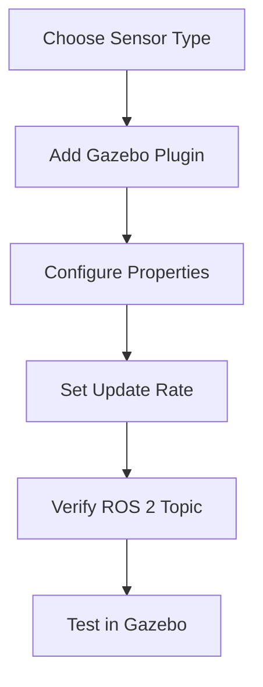

# 6.1: Sensor Integration in URDF

## Overview

Learn to integrate essential sensors into your humanoid robot URDF. This section covers IMU (balance), cameras (vision), force-torque (contact), and lidar (navigation) sensors.

**Time Required**: 45 minutes
**Difficulty**: Intermediate

## Why Sensors Matter

For humanoid robots, sensors provide critical feedback:

| Sensor Type | Primary Use | Update Rate | Essential? |
|-------------|-------------|-------------|-----------|
| **IMU** | Balance, orientation, angular velocity | 100-1000 Hz | ✅ Yes |
| **Force-Torque** | Contact detection, force control | 1000 Hz | ✅ Yes |
| **Camera** | Vision, object detection, navigation | 30-60 Hz | ⚠️ Recommended |
| **Lidar** | Long-range obstacle detection | 10-40 Hz | ❌ Optional |

## Sensor Integration Workflow



---

## 1. IMU Sensor (Inertial Measurement Unit)

### Why IMU?

IMUs provide:
- **Orientation**: Roll, pitch, yaw (Euler angles or quaternion)
- **Angular Velocity**: Rotation rates around x, y, z axes
- **Linear Acceleration**: Forces in x, y, z directions

Critical for balance control in humanoid robots!

### IMU URDF Template

Add this to your **torso link**:

```xml
<link name="torso">
  <!-- Existing visual and collision elements -->

  <!-- IMU Sensor -->
  <sensor name="imu_sensor" type="imu">
    <always_on>true</always_on>
    <update_rate>100.0</update_rate>
    <imu>
      <angular_velocity>
        <x>
          <noise type="gaussian">
            <mean>0.0</mean>
            <stddev>0.0002</stddev>
          </noise>
        </x>
        <y>
          <noise type="gaussian">
            <mean>0.0</mean>
            <stddev>0.0002</stddev>
          </noise>
        </y>
        <z>
          <noise type="gaussian">
            <mean>0.0</mean>
            <stddev>0.0002</stddev>
          </noise>
        </z>
      </angular_velocity>
      <linear_acceleration>
        <x>
          <noise type="gaussian">
            <mean>0.0</mean>
            <stddev>0.017</stddev>
          </noise>
        </x>
        <y>
          <noise type="gaussian">
            <mean>0.0</mean>
            <stddev>0.017</stddev>
          </noise>
        </y>
        <z>
          <noise type="gaussian">
            <mean>0.0</mean>
            <stddev>0.017</stddev>
          </noise>
        </z>
      </linear_acceleration>
    </imu>
  </sensor>
</link>

<!-- Gazebo Plugin (add outside <robot> tag or in separate .gazebo file) -->
<gazebo reference="torso">
  <sensor name="imu_sensor" type="imu">
    <always_on>true</always_on>
    <update_rate>100.0</update_rate>
    <plugin filename="libgazebo_ros_imu_sensor.so" name="imu_plugin">
      <ros>
        <namespace>/humanoid</namespace>
        <remapping>~/out:=imu/data</remapping>
      </ros>
      <initial_orientation_as_reference>false</initial_orientation_as_reference>
    </plugin>
  </sensor>
</gazebo>
```

### IMU Configuration Parameters

| Parameter | Recommended Value | Purpose |
|-----------|------------------|---------|
| `update_rate` | 100-200 Hz | Balance control needs fast updates |
| `angular_velocity stddev` | 0.0002 rad/s | Gyroscope noise (realistic) |
| `linear_acceleration stddev` | 0.017 m/s² | Accelerometer noise |
| `always_on` | true | Keep sensor active |

### Testing IMU Output

**Step 1: Spawn robot in Gazebo**
```bash
gz sim humanoid_world.sdf
# In another terminal:
ros2 launch your_robot_description spawn_robot.launch.py
```

**Step 2: Check IMU topic**
```bash
ros2 topic list | grep imu
# Expected: /humanoid/imu/data
```

**Step 3: View IMU data**
```bash
ros2 topic echo /humanoid/imu/data
```

**Expected output** (example):
```yaml
header:
  stamp:
    sec: 10
    nanosec: 123456789
  frame_id: torso
orientation:
  x: 0.0
  y: 0.0
  z: 0.0
  w: 1.0
angular_velocity:
  x: 0.0001
  y: -0.0002
  z: 0.0000
linear_acceleration:
  x: 0.02
  y: -0.01
  z: 9.81
```

:::tip IMU Frame Convention
- **x**: Forward
- **y**: Left
- **z**: Up
- **linear_acceleration.z** should be ~9.81 m/s² when stationary (gravity)
:::

---

## 2. Camera Sensor

### Camera Types for Humanoid Robots

| Type | Use Case | Configuration Complexity |
|------|----------|-------------------------|
| **Monocular** | Simple vision tasks | Low |
| **Stereo** | Depth perception (recommended) | Medium |
| **RGB-D** | Direct depth (like RealSense) | Medium |

We'll implement **stereo cameras** for depth perception.

### Stereo Camera URDF Template

Add to **head link**:

```xml
<link name="head">
  <!-- Existing elements -->
</link>

<!-- Left Camera -->
<gazebo reference="head">
  <sensor name="camera_left" type="camera">
    <update_rate>30.0</update_rate>
    <camera name="left_camera">
      <horizontal_fov>1.3962634</horizontal_fov>  <!-- 80 degrees -->
      <image>
        <width>640</width>
        <height>480</height>
        <format>R8G8B8</format>
      </image>
      <clip>
        <near>0.02</near>
        <far>300</far>
      </clip>
      <noise>
        <type>gaussian</type>
        <mean>0.0</mean>
        <stddev>0.007</stddev>
      </noise>
    </camera>
    <plugin filename="libgazebo_ros_camera.so" name="camera_left_plugin">
      <ros>
        <namespace>/humanoid</namespace>
        <remapping>~/image_raw:=camera/left/image_raw</remapping>
        <remapping>~/camera_info:=camera/left/camera_info</remapping>
      </ros>
      <camera_name>camera_left</camera_name>
      <frame_name>camera_left_optical_frame</frame_name>
    </plugin>
  </sensor>
</gazebo>

<!-- Right Camera (similar, offset by baseline) -->
<gazebo reference="head">
  <sensor name="camera_right" type="camera">
    <pose>0 -0.06 0 0 0 0</pose>  <!-- 6cm baseline -->
    <update_rate>30.0</update_rate>
    <camera name="right_camera">
      <horizontal_fov>1.3962634</horizontal_fov>
      <image>
        <width>640</width>
        <height>480</height>
        <format>R8G8B8</format>
      </image>
      <clip>
        <near>0.02</near>
        <far>300</far>
      </clip>
    </camera>
    <plugin filename="libgazebo_ros_camera.so" name="camera_right_plugin">
      <ros>
        <namespace>/humanoid</namespace>
        <remapping>~/image_raw:=camera/right/image_raw</remapping>
        <remapping>~/camera_info:=camera/right/camera_info</remapping>
      </ros>
      <camera_name>camera_right</camera_name>
      <frame_name>camera_right_optical_frame</frame_name>
    </plugin>
  </sensor>
</gazebo>
```

### Camera Configuration Parameters

| Parameter | Typical Value | Notes |
|-----------|--------------|-------|
| `horizontal_fov` | 1.396 rad (80°) | Wider = more peripheral vision |
| `width x height` | 640x480 | Balance resolution vs performance |
| `update_rate` | 30 Hz | 60 Hz for high-speed tasks |
| `baseline` (stereo) | 0.06m (6cm) | Distance between cameras |
| `near clip` | 0.02m | Minimum visible distance |
| `far clip` | 300m | Maximum visible distance |

### Testing Camera Output

**View camera images**:
```bash
ros2 run rqt_image_view rqt_image_view /humanoid/camera/left/image_raw
```

**Check topics**:
```bash
ros2 topic list | grep camera
# Expected:
# /humanoid/camera/left/image_raw
# /humanoid/camera/right/image_raw
# /humanoid/camera/left/camera_info
# /humanoid/camera/right/camera_info
```

**Measure frame rate**:
```bash
ros2 topic hz /humanoid/camera/left/image_raw
# Expected: ~30 Hz
```

---

## 3. Force-Torque Sensor

### Why Force-Torque Sensors?

Essential for:
- **Contact Detection**: Know when foot touches ground
- **Force Control**: Regulate contact forces during walking
- **Balance**: Detect center of pressure (CoP)

### Force-Torque URDF Template

Add to **foot links**:

```xml
<joint name="ankle_to_foot_left" type="fixed">
  <parent link="ankle_left"/>
  <child link="foot_left"/>
  <origin xyz="0 0 -0.05" rpy="0 0 0"/>
</joint>

<link name="foot_left">
  <!-- Visual and collision elements -->
</link>

<!-- Force-Torque Sensor Plugin -->
<gazebo reference="ankle_to_foot_left">
  <sensor name="ft_sensor_left_foot" type="force_torque">
    <update_rate>1000.0</update_rate>
    <force_torque>
      <frame>child</frame>  <!-- Measure forces in foot frame -->
      <measure_direction>child_to_parent</measure_direction>
    </force_torque>
    <plugin filename="libgazebo_ros_ft_sensor.so" name="ft_sensor_plugin_left">
      <ros>
        <namespace>/humanoid</namespace>
        <remapping>~/out:=ft/left_foot</remapping>
      </ros>
    </plugin>
  </sensor>
</gazebo>

<!-- Repeat for right foot -->
<gazebo reference="ankle_to_foot_right">
  <sensor name="ft_sensor_right_foot" type="force_torque">
    <update_rate>1000.0</update_rate>
    <force_torque>
      <frame>child</frame>
      <measure_direction>child_to_parent</measure_direction>
    </force_torque>
    <plugin filename="libgazebo_ros_ft_sensor.so" name="ft_sensor_plugin_right">
      <ros>
        <namespace>/humanoid</namespace>
        <remapping>~/out:=ft/right_foot</remapping>
      </ros>
    </plugin>
  </sensor>
</gazebo>
```

### Force-Torque Configuration

| Parameter | Value | Purpose |
|-----------|-------|---------|
| `update_rate` | 1000 Hz | High rate for control loops |
| `frame` | child | Measure in foot frame |
| `measure_direction` | child_to_parent | Forces from foot to ankle |

### Testing Force-Torque Sensors

**Check topics**:
```bash
ros2 topic list | grep ft
# Expected:
# /humanoid/ft/left_foot
# /humanoid/ft/right_foot
```

**View force data**:
```bash
ros2 topic echo /humanoid/ft/left_foot
```

**Expected output** (when foot on ground):
```yaml
wrench:
  force:
    x: 0.1    # Small lateral force
    y: 0.0
    z: 245.25  # ~Half body weight (50kg robot = 490N total)
  torque:
    x: 0.0
    y: 0.0
    z: 0.0
```

:::success Validation Check
**When standing on both feet**: Each foot should read ~half the robot's weight in the z-direction.
**When lifting one foot**: The grounded foot should read ~full weight.
:::

---

## 4. Lidar Sensor (Optional)

### Lidar for Navigation

Useful for:
- Long-range obstacle detection (up to 30m)
- SLAM (Simultaneous Localization and Mapping)
- Collision avoidance

### Lidar URDF Template

Add to **torso or head link**:

```xml
<gazebo reference="torso">
  <sensor name="lidar" type="gpu_lidar">
    <pose>0.1 0 0.3 0 0 0</pose>  <!-- Front of torso, elevated -->
    <update_rate>10.0</update_rate>
    <lidar>
      <scan>
        <horizontal>
          <samples>360</samples>
          <resolution>1.0</resolution>
          <min_angle>-3.14159</min_angle>  <!-- -180° -->
          <max_angle>3.14159</max_angle>   <!-- +180° -->
        </horizontal>
      </scan>
      <range>
        <min>0.1</min>
        <max>30.0</max>
        <resolution>0.01</resolution>
      </range>
      <noise>
        <type>gaussian</type>
        <mean>0.0</mean>
        <stddev>0.01</stddev>
      </noise>
    </lidar>
    <plugin filename="libgazebo_ros_ray_sensor.so" name="lidar_plugin">
      <ros>
        <namespace>/humanoid</namespace>
        <remapping>~/out:=scan</remapping>
      </ros>
      <frame_name>lidar_frame</frame_name>
      <output_type>sensor_msgs/LaserScan</output_type>
    </plugin>
  </sensor>
</gazebo>
```

### Lidar Configuration

| Parameter | Value | Notes |
|-----------|-------|-------|
| `samples` | 360 | One sample per degree |
| `update_rate` | 10 Hz | Balance performance vs data rate |
| `min/max range` | 0.1-30m | Typical 2D lidar range |
| `resolution` | 0.01m | 1cm accuracy |

### Testing Lidar

**Visualize in RViz**:
```bash
rviz2
# Add > LaserScan > Topic: /humanoid/scan
```

**Check data**:
```bash
ros2 topic echo /humanoid/scan --once
```

---

## Sensor Integration Checklist

Before moving to the next section, verify:

- [ ] IMU publishes at 100+ Hz on `/humanoid/imu/data`
- [ ] IMU shows ~9.81 m/s² in z-axis when stationary
- [ ] Cameras publish images at 30 Hz
- [ ] Camera images are clear (not black or distorted)
- [ ] Force-torque sensors show realistic forces (weight distribution)
- [ ] All sensor topics appear in `ros2 topic list`
- [ ] No error messages in Gazebo console

## Common Issues and Solutions

### IMU Shows All Zeros

**Problem**: IMU data is all zeros or NaN

**Solutions**:
1. Check IMU is attached to a link with inertia:
   ```xml
   <inertial>
     <mass value="5.0"/>  <!-- Must be > 0 -->
     <inertia ixx="0.01" iyy="0.01" izz="0.01" ixy="0" ixz="0" iyz="0"/>
   </inertial>
   ```
2. Verify plugin is loaded: `gz topic -l | grep imu`
3. Check ROS 2 bridge is running

### Camera Shows Black Image

**Problem**: Camera publishes but image is black

**Solutions**:
1. Check lighting in world file (add `<light>` elements)
2. Verify camera `pose` is correct (not inside robot)
3. Increase `far clip` distance
4. Check visual elements have materials/colors

### Force-Torque Shows Unrealistic Forces

**Problem**: Forces are 10x or 100x expected values

**Solutions**:
1. Verify link mass is correct (not 1000kg when should be 2kg)
2. Check `measure_direction` is `child_to_parent`
3. Confirm joint type (should be `fixed` or `revolute`, not `floating`)

### Sensors Not Publishing

**Problem**: `ros2 topic list` doesn't show sensor topics

**Solutions**:
1. Install ROS-Gazebo bridge:
   ```bash
   sudo apt install ros-humble-ros-gz-sim
   ```
2. Source workspace: `source ~/ros2_ws/install/setup.bash`
3. Check plugin filename matches your ROS 2 distro (humble, iron, etc.)
4. Verify `<ros>` namespace is correct

## Performance Optimization

### Sensor Update Rates

Adjust based on needs:

| Sensor | High Performance | Balanced | High Fidelity |
|--------|-----------------|----------|---------------|
| IMU | 100 Hz | 200 Hz | 1000 Hz |
| Camera | 15 Hz | 30 Hz | 60 Hz |
| Force-Torque | 500 Hz | 1000 Hz | 2000 Hz |
| Lidar | 5 Hz | 10 Hz | 40 Hz |

### GPU Acceleration

For cameras and lidar, use GPU plugins:
- `gpu_lidar` instead of `ray`
- `gpu_ray` for GPU-accelerated raycasting

Requires CUDA-capable GPU.

## What's Next?

Now that sensors are integrated, learn to optimize collision geometry for realistic physics!

👉 **[Next: Collision Geometry →](./collision-geometry)**

---

## Additional Resources

- 📖 [Gazebo Sensor Types](https://gazebosim.org/api/sensors/8/namespaceignition_1_1sensors.html)
- 📖 [ROS 2 Gazebo Plugins](https://github.com/gazebosim/ros_gz)
- 💬 [Sensor Integration Forum](https://answers.gazebosim.org/)

## Summary

In this section, you:
- ✅ Added IMU sensor to torso for balance feedback
- ✅ Configured stereo cameras in head for vision
- ✅ Integrated force-torque sensors in feet for contact detection
- ✅ (Optional) Added lidar for navigation
- ✅ Tested all sensors publish correct ROS 2 topics
- ✅ Validated sensor data matches expected values

**Time Invested**: ~45 minutes | **Status**: Sensors Integrated ✓
