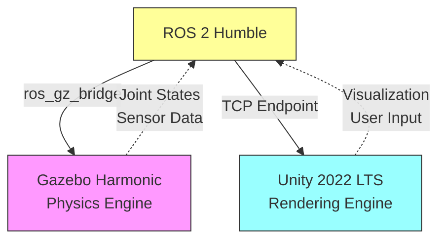
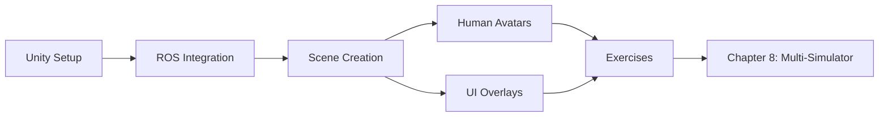

# Chapter 7: Unity Rendering and Human-Robot Interaction

## Chapter Overview

Welcome to Chapter 7! Learn to use **Unity** as a high-quality visualization front-end while **Gazebo** handles physics simulation. This dual-simulator approach gives you the best of both worlds: realistic physics and stunning visuals.

:::tip Priority 3 - Enhancement
This chapter is marked **P3 (Priority 3)** - it's optional but highly valuable for creating professional HRI demonstrations and user interfaces.
:::

## What You'll Learn

By completing this chapter, you will be able to:

1. ✅ **Install** Unity 2022 LTS and ROS-TCP-Connector package
2. ✅ **Integrate** Unity with ROS 2 using TCP bridge communication
3. ✅ **Create** 3D visualization scenes synchronized with Gazebo physics
4. ✅ **Add** human avatars for realistic HRI scenario testing
5. ✅ **Build** UI overlays displaying real-time sensor data and robot status
6. ✅ **Deploy** cross-platform visualizations (Windows, Linux, WebGL)

## Why Unity + Gazebo?

### The Dual-Simulator Architecture



### Strengths of Each Simulator

| Feature | Gazebo Harmonic | Unity 2022 LTS | Best For |
|---------|-----------------|----------------|----------|
| **Physics** | ⭐⭐⭐⭐⭐ Excellent | ⭐⭐⭐ Good | Gazebo |
| **Graphics** | ⭐⭐⭐ Good | ⭐⭐⭐⭐⭐ Excellent | Unity |
| **HRI Avatars** | ⭐ Limited | ⭐⭐⭐⭐⭐ Excellent | Unity |
| **ROS 2 Native** | ⭐⭐⭐⭐⭐ Native | ⭐⭐⭐ Via Bridge | Gazebo |
| **UI/UX** | ⭐⭐ Basic | ⭐⭐⭐⭐⭐ Professional | Unity |
| **Cross-Platform** | ⭐⭐ Linux-first | ⭐⭐⭐⭐⭐ Win/Mac/Web | Unity |

### Use Cases for Unity Integration

**When to use Unity**:
- 🎨 Public demonstrations requiring stunning visuals
- 👤 HRI research with human avatars and social behaviors
- 📱 Cross-platform deployment (web dashboards, mobile apps)
- 🎮 VR/AR interfaces for robot teleoperation
- 📊 Rich data visualization dashboards

**When Gazebo alone is sufficient**:
- 🔬 Pure physics simulation and testing
- 🤖 Algorithm development (navigation, manipulation)
- 🏭 Headless CI/CD testing pipelines
- ⚡ Maximum physics performance required

## Prerequisites

Before starting this chapter, ensure you have:

- ✅ **Chapters 5-6 Completed**: Gazebo basics and URDF physics
- ✅ **Operating System**: Windows 10/11 (preferred) or Ubuntu 22.04
- ✅ **Hardware**:
  - GPU with DirectX 11/12 or Vulkan support
  - 16GB RAM recommended (8GB minimum)
  - 20GB free disk space for Unity
- ✅ **ROS 2 Humble**: Installed and working
- ✅ **Unity Hub**: Free account (personal license)

:::warning GPU Required
Unlike Gazebo which can run headless, Unity **requires** a GPU. No software rendering fallback available.
:::

## Chapter Structure

### 📚 Sections

1. **[Unity Setup](./unity-setup)** (30 min)
   - Install Unity Hub and Unity 2022 LTS
   - Install ROS-TCP-Connector package
   - Verify GPU and build settings

2. **[ROS Integration](./ros-integration)** (45 min)
   - Set up ROS-TCP-Endpoint on ROS 2 side
   - Configure Unity-ROS communication
   - Test message passing (joint states, transforms)

3. **[Scene Creation](./scene-creation)** (45 min)
   - Import URDF models into Unity
   - Create environment and lighting
   - Synchronize with Gazebo simulation

4. **[Human Avatars](./human-avatars)** (40 min)
   - Add rigged human characters
   - Implement animations and behaviors
   - Design HRI test scenarios

5. **[UI Overlays](./ui-overlays)** (40 min)
   - Build sensor data displays
   - Create control panels
   - Implement AR/VR UI elements

6. **[Exercises](./exercises)** (40 min)
   - Complete HRI visualization scene
   - Multi-robot visualization
   - Build web dashboard

**Total Estimated Time**: 3-4 hours

## Learning Path



## Success Criteria

You'll know you've mastered this chapter when you can:

- ✅ Launch Unity and Gazebo simultaneously with synchronized robot state
- ✅ Visualize ROS 2 joint states in Unity in real-time
- ✅ Add human characters that interact with robot in scene
- ✅ Build custom UI displaying sensor data from ROS topics
- ✅ Complete all exercises within 40 minutes

## Key Concepts Preview

### Unity-ROS Communication Flow

```
ROS 2 Node (Python/C++)
    ↓ publishes /joint_states
ROS-TCP-Endpoint (TCP Server on port 10000)
    ↓ TCP/IP connection
Unity ROS-TCP-Connector (C# Client)
    ↓ deserializes messages
Unity GameObjects (Visual representation)
```

### Architecture Overview

1. **Gazebo**: Runs physics simulation, publishes sensor data to ROS topics
2. **ROS 2**: Middleware layer connecting both simulators
3. **ROS-TCP-Endpoint**: Python node that bridges ROS 2 ↔ Unity via TCP
4. **Unity**: Subscribes to topics via TCP, renders visualization

:::info Why TCP Instead of Native ROS?
Unity runs on Windows (not Linux-first like ROS), and the ROS 2 .NET client is limited. TCP provides cross-platform compatibility and easier C# integration.
:::

## What You'll Build

By the end of this chapter, you'll have created:

1. **Unity Project** with:
   - Imported humanoid robot model
   - Real-time joint state visualization
   - Synchronized camera views

2. **HRI Scene** featuring:
   - Human avatar approaching robot
   - Robot head tracking human position
   - Safety zone visualization

3. **Dashboard UI** showing:
   - Joint positions and velocities
   - Battery level (simulated)
   - Camera feed display
   - Control buttons

4. **Launch System**:
   - Single launch file starting Gazebo + Unity endpoint
   - Automatic synchronization

## System Architecture

### File Structure Preview

```
humanoid_visualization/
├── unity_project/
│   ├── Assets/
│   │   ├── RosMessages/        # Auto-generated C# message classes
│   │   ├── Scripts/
│   │   │   ├── ROSConnection.cs        # TCP client
│   │   │   ├── JointStateSubscriber.cs # Visualizer
│   │   │   └── TransformTreePublisher.cs
│   │   ├── Scenes/
│   │   │   ├── HumanoidVisualization.unity
│   │   │   └── HRIDemo.unity
│   │   ├── Models/              # Imported URDF meshes
│   │   └── UI/                  # Canvas and panels
│   └── Packages/
│       └── com.unity.robotics.ros-tcp-connector/
├── ros2_ws/
│   └── src/
│       └── unity_bridge/
│           ├── launch/
│           │   └── unity_viz.launch.py
│           └── config/
│               └── tcp_endpoint_params.yaml
```

## Common Questions

<details>
<summary><strong>Q: Can I use Unity without Gazebo?</strong></summary>

**Yes**, but with limitations:
- Unity has basic physics (PhysX), not robotics-grade like Gazebo
- No native sensor simulation (lidar, IMU, force-torque)
- ROS 2 integration is more complex without Gazebo bridge

**Recommended**: Use Gazebo for physics, Unity for visualization (this chapter's approach).

</details>

<details>
<summary><strong>Q: Do I need Unity Pro (paid license)?</strong></summary>

**No!** Unity Personal (free) includes everything needed:
- ROS-TCP-Connector works with Personal
- No revenue limits for educational/research use
- All features except team collaboration tools

</details>

<details>
<summary><strong>Q: Will this work on Mac?</strong></summary>

**Partially**:
- Unity runs great on Mac (Intel or Apple Silicon)
- ROS 2 on Mac is experimental (use Docker or Linux VM)
- Recommended: Unity on Mac, ROS 2 in Linux VM, network bridge

</details>

<details>
<summary><strong>Q: Can I deploy Unity visualizations to web browsers?</strong></summary>

**Yes!** Unity supports WebGL export:
```bash
# Build for WebGL
Unity Build Settings → WebGL → Build
```
Host on web server for browser-based robot dashboards. Note: ROS-TCP-Connector works via WebSockets in WebGL builds.

</details>

<details>
<summary><strong>Q: How much C# programming is required?</strong></summary>

**Minimal**. This chapter provides:
- Complete script templates
- Copy-paste examples
- Visual editor configuration (no coding)

You'll understand concepts without deep C# expertise.

</details>

## Prerequisites Check

### Hardware Verification

Check your GPU support:

**Windows**:
```powershell
dxdiag
# Check "Display" tab for DirectX 12 support
```

**Linux**:
```bash
glxinfo | grep "OpenGL version"
# Should show 4.x or higher
```

### Software Checklist

Before proceeding, verify:

- [ ] ROS 2 Humble installed (`ros2 --version`)
- [ ] Gazebo Harmonic working (from Chapter 5)
- [ ] Python 3.10+ (`python3 --version`)
- [ ] 20GB free disk space (`df -h`)
- [ ] Unity Hub account created (free)

:::success Ready to Start?
If all checks pass, you're ready to install Unity and build stunning robot visualizations!
:::

## Performance Expectations

### Target Frame Rates

| Configuration | Gazebo (Physics) | Unity (Rendering) | Notes |
|---------------|------------------|-------------------|-------|
| **High-end PC** | 100+ Hz | 60 FPS | Smooth, real-time |
| **Mid-range PC** | 60-100 Hz | 30-60 FPS | Acceptable |
| **Low-end PC** | 30-60 Hz | 20-30 FPS | May lag |

:::tip Optimization Strategy
Run Gazebo headless (`gz sim -s`) for maximum physics performance, use Unity for all visualization. This is the recommended production approach.
:::

## What's Different from Gazebo Visualization?

| Aspect | Gazebo GUI | Unity Rendering |
|--------|------------|-----------------|
| **Quality** | Functional | Photorealistic |
| **Customization** | Limited | Unlimited |
| **HRI Elements** | None | Full avatar support |
| **UI/UX** | Developer-focused | User-friendly |
| **Deployment** | Linux only | Cross-platform |
| **Learning Curve** | Low | Medium |

## Getting Started

Ready to create beautiful robot visualizations? Let's install Unity!

👉 **[Start with Unity Setup →](./unity-setup)**

---

## Quick Links

- 📖 [Unity Robotics Hub GitHub](https://github.com/Unity-Technologies/Unity-Robotics-Hub)
- 📖 [ROS-TCP-Connector Documentation](https://github.com/Unity-Technologies/ROS-TCP-Connector)
- 🎓 [Unity Learn: Robotics Tutorials](https://learn.unity.com/course/unity-robotics-hub)
- ⬅️ [Back to Module 2 Overview](/docs/module-2/)
- ➡️ [Next: Chapter 8 Multi-Simulator](/docs/module-2/chapter-8-multi-simulator/)

---

**Estimated Completion**: 3-4 hours | **Difficulty**: Intermediate | **Priority**: P3 (Enhancement)
