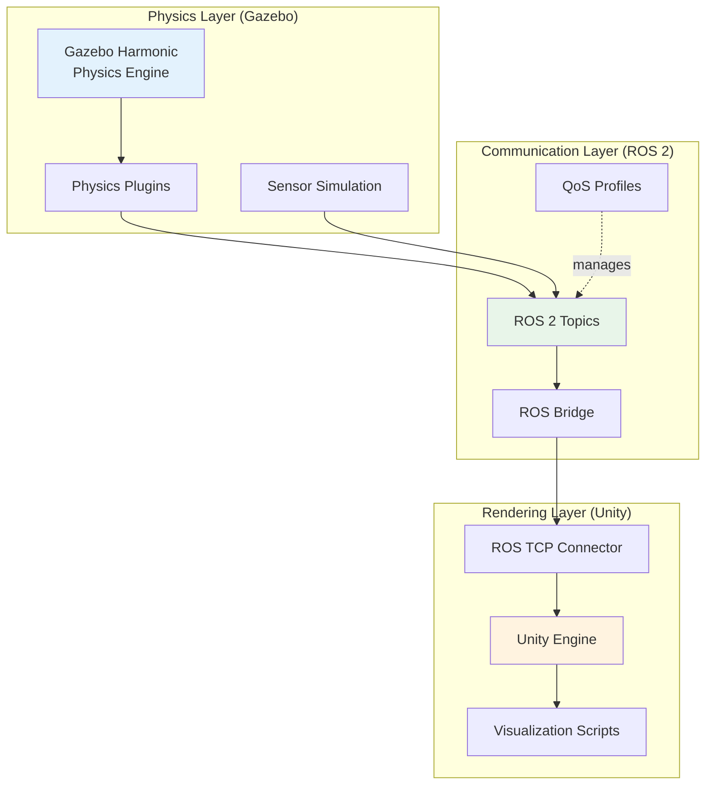
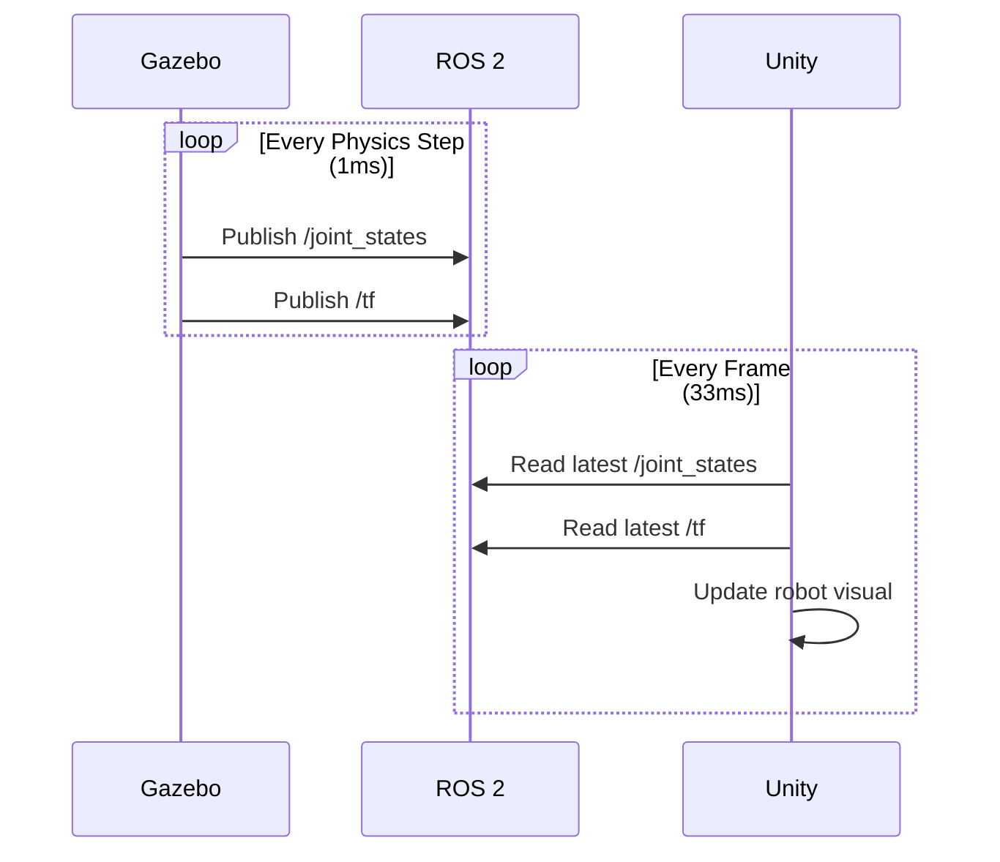
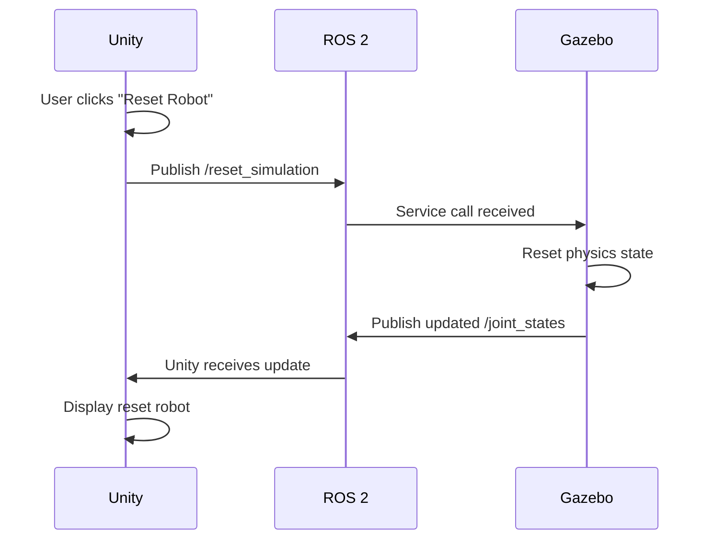
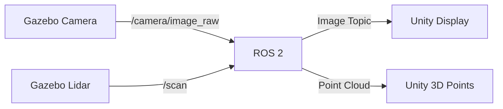

# 8.1: Multi-Simulator Architecture

## Overview

In this section, you'll learn the fundamental architecture patterns for building robust multi-simulator systems. We'll cover system design, data flow, communication patterns, and best practices used in production robotics systems.

**Time Required**: 30 minutes
**Difficulty**: Intermediate-Advanced

## System Architecture

### High-Level Design

The multi-simulator architecture follows a **separation of concerns** principle:



### Component Responsibilities

| Component | Responsibility | Update Rate | Resource Usage |
|-----------|---------------|-------------|----------------|
| **Gazebo** | Physics simulation, collision detection, sensor data generation | 100-1000 Hz | High CPU, Low GPU |
| **ROS 2** | Message transport, topic management, QoS enforcement | Variable | Low CPU, Low Network |
| **Unity** | Visual rendering, UI overlays, human avatar animation | 30-60 FPS | Moderate CPU, High GPU |

### Design Principles

#### 1. Single Source of Truth (Gazebo)

Gazebo is the **physics authority**. Unity is a **visual client** that displays Gazebo's state.

```
Gazebo (Truth) --> ROS 2 Topics --> Unity (Display)
     ✅ Physics                          ❌ Physics
     ✅ Collisions                       ✅ Rendering
     ✅ Sensors                          ✅ UI/HRI
```

**Why?**
- Gazebo has production-grade physics engines (Bullet, DART)
- Unity physics is designed for games, not robotics
- One source of truth prevents state divergence

#### 2. Asynchronous Communication

Simulators run at different rates and must not block each other:

```python
# Gazebo: 1000 Hz (1ms per step)
while gazebo_running:
    physics_step()  # 1ms
    publish_joint_states()  # Non-blocking

# Unity: 30 Hz (33ms per frame)
while unity_running:
    render_frame()  # 33ms
    update_from_latest_joint_states()  # Non-blocking
```

**Key**: Unity always renders the **most recent** data from Gazebo, without waiting.

#### 3. Layered Architecture

```
┌─────────────────────────────────────────┐
│        Application Layer                │  User Code
│  (Controllers, Planners, HRI Logic)     │
├─────────────────────────────────────────┤
│        Abstraction Layer                │  ROS 2 Topics
│   (Joint States, TF, Sensors, Clock)    │
├──────────────────┬──────────────────────┤
│  Physics Engine  │   Rendering Engine   │  Simulators
│    (Gazebo)      │      (Unity)         │
└──────────────────┴──────────────────────┘
```

**Benefits**:
- Swap simulators without changing application code
- Test on real robot using same ROS 2 interface
- Parallel development (physics vs rendering teams)

## Data Flow Patterns

### Pattern 1: Physics-to-Visual (Primary)

**Purpose**: Display robot state in Unity



**Topics**:
- `/joint_states` (sensor_msgs/JointState): Joint positions, velocities, efforts
- `/tf` (tf2_msgs/TFMessage): Transform tree for all links
- `/clock` (rosgraph_msgs/Clock): Simulation time (optional)

**QoS Profile**:
```python
from rclpy.qos import QoSProfile, ReliabilityPolicy, HistoryPolicy

qos = QoSProfile(
    reliability=ReliabilityPolicy.BEST_EFFORT,  # Fast, allow drops
    history=HistoryPolicy.KEEP_LAST,
    depth=1  # Only latest message matters
)
```

### Pattern 2: Visual-to-Physics (Secondary)

**Purpose**: User inputs from Unity to Gazebo



**Topics/Services**:
- `/cmd_vel` (geometry_msgs/Twist): Velocity commands (if applicable)
- `/reset_simulation` (std_srvs/Empty): Reset service
- `/spawn_entity` (gazebo_msgs/SpawnEntity): Spawn new objects

**QoS Profile**:
```python
# For commands, use reliable delivery
qos_commands = QoSProfile(
    reliability=ReliabilityPolicy.RELIABLE,  # Ensure delivery
    history=HistoryPolicy.KEEP_LAST,
    depth=10
)
```

### Pattern 3: Bidirectional Sensor Data

**Purpose**: Sensors simulated in Gazebo, visualized in Unity



**Common Sensor Topics**:
- `/camera/image_raw` (sensor_msgs/Image): RGB images
- `/camera/depth/image_raw` (sensor_msgs/Image): Depth maps
- `/scan` (sensor_msgs/LaserScan): 2D lidar
- `/points` (sensor_msgs/PointCloud2): 3D lidar
- `/imu` (sensor_msgs/Imu): Inertial measurement unit

## Topic Mapping Table

Essential topics for humanoid robot simulation:

| Topic | Type | Publisher | Subscriber | Rate | QoS |
|-------|------|-----------|------------|------|-----|
| `/joint_states` | sensor_msgs/JointState | Gazebo | Unity | 100-1000 Hz | Best Effort, Depth 1 |
| `/tf` | tf2_msgs/TFMessage | Gazebo | Unity | 100-1000 Hz | Best Effort, Depth 1 |
| `/clock` | rosgraph_msgs/Clock | Gazebo | Unity (opt) | 100-1000 Hz | Best Effort, Depth 1 |
| `/camera/image_raw` | sensor_msgs/Image | Gazebo | Unity | 30 Hz | Best Effort, Depth 5 |
| `/cmd_vel` | geometry_msgs/Twist | Unity | Gazebo | Variable | Reliable, Depth 10 |
| `/reset_sim` | std_srvs/Empty | Unity | Gazebo | On-demand | Reliable, Depth 1 |

## Network Architecture Options

### Option 1: Same Machine (Development)

```
┌──────────────────────────────────────┐
│         Single Computer              │
│                                      │
│  ┌─────────┐      ┌──────────┐     │
│  │ Gazebo  │ ←──→ │  Unity   │     │
│  │ (CPU)   │ ROS2 │  (GPU)   │     │
│  └─────────┘      └──────────┘     │
│       Localhost (127.0.0.1)        │
└──────────────────────────────────────┘
```

**Pros**: Simple setup, no network configuration
**Cons**: High resource usage on single machine

### Option 2: Distributed (Production)

```
┌─────────────────┐         ┌──────────────────┐
│  Linux Server   │         │  Workstation     │
│                 │         │                  │
│  ┌───────────┐  │  ROS 2  │  ┌────────────┐  │
│  │  Gazebo   │←─┼─────────┼→ │   Unity    │  │
│  │ (Headless)│  │  DDS    │  │  (w/ GPU)  │  │
│  └───────────┘  │  Multicast│  └────────────┘  │
│                 │         │                  │
└─────────────────┘         └──────────────────┘
    192.168.1.10              192.168.1.20
```

**Pros**: Optimized resource allocation, scalable
**Cons**: Network latency, requires DDS configuration

**DDS Configuration** (`fastdds.xml`):
```xml
<?xml version="1.0" encoding="UTF-8" ?>
<dds>
    <profiles xmlns="http://www.eprosima.com/XMLSchemas/fastRTPS_Profiles">
        <transport_descriptors>
            <transport_descriptor>
                <transport_id>UDPv4</transport_id>
                <type>UDPv4</type>
            </transport_descriptor>
        </transport_descriptors>

        <participant profile_name="multi_sim_profile">
            <rtps>
                <userTransports>
                    <transport_id>UDPv4</transport_id>
                </userTransports>
                <useBuiltinTransports>false</useBuiltinTransports>
            </rtps>
        </participant>
    </profiles>
</dds>
```

### Option 3: Hybrid Cloud (Advanced)

```
┌─────────────────┐
│  AWS/Azure VM   │
│  ┌───────────┐  │  Internet
│  │  Gazebo   │←─┼──────────┐
│  │ (Headless)│  │          │
│  └───────────┘  │          ↓
└─────────────────┘    ┌──────────────┐
                       │ Local PC     │
                       │  ┌────────┐  │
                       │  │ Unity  │  │
                       │  └────────┘  │
                       └──────────────┘
```

**Use Case**: Heavy physics, light rendering local
**Cons**: Network latency (50-200ms typical)

## State Synchronization Strategy

### Timestamp-Based Synchronization

Every message includes a timestamp for alignment:

```python
# Gazebo publishes with timestamp
msg = JointState()
msg.header.stamp = self.get_clock().now().to_msg()
msg.name = ['joint1', 'joint2', ...]
msg.position = [0.1, 0.2, ...]
publisher.publish(msg)
```

```csharp
// Unity renders based on timestamp
void OnJointStateReceived(JointState msg)
{
    double messageTime = msg.header.stamp.sec + msg.header.stamp.nanosec * 1e-9;
    double currentTime = Time.timeAsDouble;
    double latency = currentTime - messageTime;

    if (latency < 0.1)  // Less than 100ms old
    {
        UpdateRobotPose(msg.position);
    }
    else
    {
        Debug.LogWarning($"Stale data: {latency*1000:F1}ms latency");
    }
}
```

### Clock Synchronization (Optional)

For precise synchronization, use `/clock` topic:

```python
# Gazebo publishes clock
clock_msg = Clock()
clock_msg.clock = self.get_clock().now().to_msg()
self.clock_pub.publish(clock_msg)
```

```csharp
// Unity uses simulation time
void OnClockReceived(Clock msg)
{
    simulationTime = msg.clock.sec + msg.clock.nanosec * 1e-9;
    // Use simulationTime instead of wall clock
}
```

**When to use**:
- Recording/playback scenarios
- Deterministic testing
- Slow-motion or fast-forward simulation

## Error Handling Architecture

### Graceful Degradation

System should handle partial failures:

```python
# Unity behavior when Gazebo disconnects
class RobotVisualizer:
    def update(self):
        if self.last_message_age() < 1.0:  # Recent data
            self.status = "CONNECTED"
            self.update_robot_pose()
        elif self.last_message_age() < 5.0:  # Stale data
            self.status = "DEGRADED"
            self.use_extrapolation()  # Predict pose
        else:  # No data
            self.status = "DISCONNECTED"
            self.show_error_overlay()
```

### Heartbeat Monitoring

```python
# Gazebo: Publish heartbeat
def heartbeat_timer_callback(self):
    msg = Header()
    msg.stamp = self.get_clock().now().to_msg()
    msg.frame_id = "gazebo_heartbeat"
    self.heartbeat_pub.publish(msg)
```

```csharp
// Unity: Monitor heartbeat
float lastHeartbeat = 0f;

void Update()
{
    if (Time.time - lastHeartbeat > 2.0f)
    {
        ShowWarning("Gazebo connection lost!");
    }
}

void OnHeartbeatReceived(Header msg)
{
    lastHeartbeat = Time.time;
}
```

## Architecture Checklist

Before implementing, ensure your design has:

- [ ] Clear definition of which simulator owns which state
- [ ] All required topics identified with QoS profiles
- [ ] Network architecture decided (same machine vs distributed)
- [ ] Synchronization strategy chosen (timestamped vs clock)
- [ ] Error handling for disconnections defined
- [ ] Performance targets specified (Hz, FPS, latency)
- [ ] Monitoring and logging plan in place

## Best Practices

### 1. Keep Simulators Loosely Coupled

```python
# GOOD: Simulators don't know about each other
gazebo_publishes("/joint_states")
unity_subscribes("/joint_states")

# BAD: Direct coupling
gazebo.send_to_unity(data)  # Hard dependency
```

### 2. Use Standard ROS 2 Messages

```python
# GOOD: Standard messages
from sensor_msgs.msg import JointState

# AVOID: Custom messages (unless necessary)
from my_package.msg import MyCustomJointState
```

### 3. Design for Observability

```python
# Publish metrics for monitoring
metrics_msg = DiagnosticStatus()
metrics_msg.name = "gazebo_performance"
metrics_msg.message = f"RTF: {real_time_factor:.2f}"
metrics_msg.level = DiagnosticStatus.OK
self.metrics_pub.publish(metrics_msg)
```

### 4. Plan for Scale

```python
# Support multiple robots with namespacing
robot_namespace = "/robot_1"
joint_states_topic = f"{robot_namespace}/joint_states"
```

## Common Pitfalls to Avoid

| Pitfall | Problem | Solution |
|---------|---------|----------|
| **Synchronous calls** | Unity blocks waiting for Gazebo | Use async/callbacks |
| **Tight coupling** | Can't swap simulators | Use ROS 2 abstraction |
| **No error handling** | Crashes on disconnect | Implement graceful degradation |
| **Wrong QoS** | Message loss or latency | Match QoS to use case |
| **Clock mismatch** | Desynced visualization | Use simulation clock |
| **Resource contention** | Both use 100% GPU | Run Gazebo headless |

## What's Next

Now that you understand the architecture, let's implement it with ROS 2 launch files!

👉 **[Next: Launch Coordination →](./launch-coordination)**

---

## Additional Resources

- 📖 [ROS 2 DDS Configuration](https://docs.ros.org/en/humble/Concepts/About-Different-Middleware-Vendors.html)
- 📊 [QoS Profiles Explained](https://docs.ros.org/en/humble/Concepts/About-Quality-of-Service-Settings.html)
- 🏗️ [Software Architecture Patterns for Robotics](https://arxiv.org/abs/2104.12911)

## Summary

In this section, you learned:
- ✅ Multi-simulator architecture patterns (separation of concerns)
- ✅ Data flow between Gazebo, ROS 2, and Unity
- ✅ Topic mapping and QoS configuration strategies
- ✅ Network architecture options (local, distributed, cloud)
- ✅ State synchronization with timestamps and clocks
- ✅ Error handling and graceful degradation patterns

**Time Invested**: ~30 minutes | **Status**: Architecture Designed ✓
