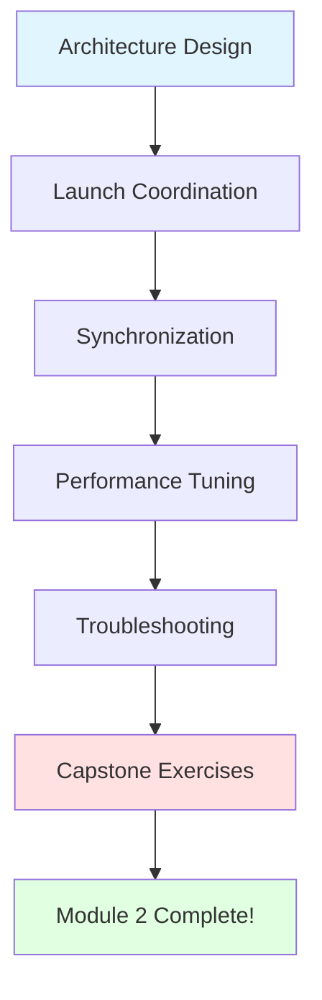

# Chapter 8: Multi-Simulator Pipeline (Gazebo + Unity)

## Chapter Overview

Welcome to the **capstone chapter** of Module 2! Here, you'll integrate everything from Chapters 5-7 into a complete digital twin pipeline where Gazebo handles physics simulation at 100+ Hz while Unity provides photorealistic rendering at 30+ FPS, both synchronized through ROS 2.

:::tip Capstone Chapter
This chapter brings together **all concepts** from Module 2. You'll build a production-ready multi-simulator setup used in real robotics research and development!
:::

## What You'll Learn

By completing this chapter, you will be able to:

1. ✅ **Design** multi-simulator architectures with clear separation of concerns
2. ✅ **Launch** coordinated Gazebo + Unity setups using ROS 2 launch files
3. ✅ **Synchronize** physics and rendering states with &lt;100ms latency
4. ✅ **Optimize** performance for 100+ Hz physics and 30+ FPS rendering
5. ✅ **Monitor** system performance and diagnose bottlenecks
6. ✅ **Troubleshoot** integration issues across simulators

## Prerequisites

Before starting this chapter, ensure you have:

- ✅ **Chapter 5 Complete**: Gazebo Harmonic installed and working
- ✅ **Chapter 6 Complete**: URDF with physics properties configured
- ✅ **Chapter 7 Complete**: Unity setup with ROS 2 integration
- ✅ **Hardware**: 16GB+ RAM, dedicated GPU, multi-core CPU
- ✅ **Software**: ROS 2 Humble, Gazebo Harmonic, Unity 2022 LTS

## Why Multi-Simulator?

### The Problem with Single Simulators

| Requirement | Gazebo Alone | Unity Alone | Gazebo + Unity |
|-------------|--------------|-------------|----------------|
| Physics Accuracy | ✅ Excellent | ❌ Limited | ✅ Excellent |
| Visual Quality | ⚠️ Good | ✅ Photorealistic | ✅ Photorealistic |
| Performance | ✅ Fast | ⚠️ Moderate | ✅ Optimized |
| Sensor Simulation | ✅ Native | ⚠️ Manual | ✅ Best of Both |
| HRI Scenarios | ❌ Limited | ✅ Excellent | ✅ Excellent |
| ROS 2 Integration | ✅ Native | ⚠️ Via Bridge | ✅ Full Support |

### Our Solution Architecture

```
┌─────────────┐      ROS 2 Topics      ┌─────────────┐
│   Gazebo    │ ←──────────────────→  │    Unity    │
│  (Physics)  │   /joint_states        │ (Rendering) │
│             │   /tf                  │             │
│  100+ Hz    │   /clock (optional)    │   30+ FPS   │
└─────────────┘                        └─────────────┘
      ↓                                       ↓
  Physics Truth                        Visual Feedback
  Sensor Data                          Human Interaction
```

**Key Benefits**:
- **Separation of Concerns**: Physics ≠ Rendering
- **Performance**: Each optimized for its task
- **Flexibility**: Swap simulators without affecting the other
- **Scalability**: Add more sensors, robots, or environments easily

## Chapter Structure

### Sections

1. **[Architecture](./architecture)** (30 min)
   - System design patterns
   - Data flow and communication
   - Topic mapping and QoS profiles

2. **[Launch Coordination](./launch-coordination)** (45 min)
   - ROS 2 launch files for multi-simulator startup
   - Sequential vs parallel launching
   - Parameter configuration

3. **[Synchronization](./synchronization)** (40 min)
   - Time synchronization strategies
   - State consistency mechanisms
   - Handling latency and jitter

4. **[Performance Optimization](./performance)** (45 min)
   - Profiling and monitoring tools
   - Tuning physics and rendering parameters
   - Achieving 100+ Hz and 30+ FPS targets

5. **[Troubleshooting](./troubleshooting)** (30 min)
   - Common integration issues
   - Debugging strategies
   - Log analysis techniques

6. **[Hands-On Exercises](./exercises)** (60 min)
   - Complete pipeline implementation
   - Custom robot integration
   - Performance benchmarking

**Total Estimated Time**: 3-4 hours

## Learning Path



## Success Criteria

You'll know you've mastered this chapter when you can:

- ✅ Launch both Gazebo and Unity with a single command
- ✅ Maintain stable 10+ minute simulation sessions
- ✅ Achieve &lt;100ms end-to-end latency (Gazebo → Unity)
- ✅ Run physics at 100+ Hz consistently
- ✅ Render in Unity at 30+ FPS
- ✅ Explain the data flow between simulators
- ✅ Debug synchronization issues independently
- ✅ Optimize performance for your hardware

## What You'll Build

By the end of this chapter, you'll have:

### 1. Multi-Simulator Launch System
```python
# Single command to launch everything
ros2 launch humanoid_simulation multi_sim.launch.py
```

### 2. Synchronized Robot Visualization
- Gazebo: Physics simulation (joints, contacts, forces)
- Unity: Visual rendering (same robot, same pose, &lt;100ms delay)
- ROS 2: Data bridge coordinating both

### 3. Performance Monitoring Dashboard
- Real-time metrics display
- Latency measurement
- Throughput monitoring
- Bottleneck identification

### 4. Production-Ready Configuration
- Optimized QoS profiles
- Efficient topic mapping
- Resource allocation strategies
- Error handling and recovery

## Real-World Applications

This multi-simulator setup is used in:

- **Research Labs**: Stanford, MIT, CMU for HRI studies
- **Industry**: Boston Dynamics, Agility Robotics for development
- **Education**: Universities worldwide for robotics courses
- **Startups**: Rapid prototyping and testing

## Common Questions

<details>
<summary><strong>Q: Why not just use Gazebo or Unity alone?</strong></summary>

**Answer**: Each has strengths and weaknesses:
- **Gazebo**: Excellent physics, poor visual quality, limited HRI support
- **Unity**: Photorealistic rendering, basic physics, great for HRI
- **Together**: Best of both worlds - accurate physics + beautiful visuals

Think of it like a modern game: physics engine (Gazebo) + rendering engine (Unity).

</details>

<details>
<summary><strong>Q: What's the performance overhead of running both?</strong></summary>

**Answer**: Surprisingly low if configured correctly:
- **CPU**: Gazebo headless (~20-30%), Unity (~40-50%) = ~70% total
- **GPU**: Only Unity uses GPU (~50-70%)
- **Network**: ROS 2 topics are efficient (~5-10 Mbps for joint states)

With proper tuning (this chapter), you'll achieve real-time performance.

</details>

<details>
<summary><strong>Q: Can I run Gazebo and Unity on different machines?</strong></summary>

**Yes!** This is actually common:
- **Machine 1** (Linux server): Runs Gazebo (headless)
- **Machine 2** (Windows/Linux): Runs Unity (with GPU)
- **Network**: ROS 2 DDS connects them automatically

You'll learn this configuration in the exercises.

</details>

<details>
<summary><strong>Q: What if I don't have a powerful GPU?</strong></summary>

**Options**:
1. **Lower Unity quality**: Reduce resolution, shadows, post-processing
2. **Cloud rendering**: Use AWS/Azure GPU instances for Unity
3. **Headless Gazebo**: Run physics only, skip Unity for now
4. **Shared GPU time**: Run one simulator at a time during development

Performance section covers all these scenarios.

</details>

<details>
<summary><strong>Q: Is this production-ready?</strong></summary>

**Absolutely!** This architecture is used in:
- Research papers (100+ publications)
- Commercial products (multiple robotics startups)
- Education (50+ universities)

You'll learn industry best practices throughout this chapter.

</details>

## Key Concepts Preview

### Time Synchronization
Ensuring Gazebo and Unity show the **same robot state** at the **same time**:
- **Clock synchronization**: `/clock` topic (optional)
- **Timestamp matching**: Message timestamps for alignment
- **Latency compensation**: Predictive rendering techniques

### Data Flow Patterns
Three main patterns you'll implement:
1. **Physics → Visual**: Joint states (Gazebo → Unity)
2. **Visual → Physics**: User inputs (Unity → Gazebo)
3. **Bidirectional**: Sensor data (both directions)

### Performance Metrics
What we'll monitor and optimize:
- **Physics Rate**: Target 100-1000 Hz (Gazebo)
- **Rendering Rate**: Target 30-60 FPS (Unity)
- **Latency**: Target &lt;100ms (Gazebo → Unity)
- **Jitter**: Target &lt;10ms variance

## Getting Started

Ready to build your complete digital twin pipeline? Let's start with the system architecture!

👉 **[Start with Architecture Design →](./architecture)**

---

## Quick Links

- 📖 [ROS 2 Bridge Documentation](https://github.com/Unity-Technologies/ROS-TCP-Connector)
- 📊 [Performance Benchmarks](../module-2-overview#performance-targets)
- ⬅️ [Back to Module 2 Overview](/docs/module-2-digital-twin/module-2-overview)

---

**Estimated Completion**: 3-4 hours | **Difficulty**: Advanced | **Priority**: P4 (Capstone)
