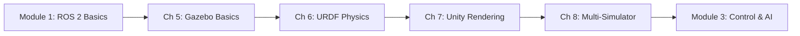

# Module 2: The Digital Twin (Gazebo & Unity)

## Overview

Welcome to Module 2, where you'll learn to create **simulation-based digital twins** for humanoid robots. This module teaches you to use two powerful tools together:

- **Gazebo Harmonic**: Industry-standard physics simulation for accurate robot dynamics
- **Unity 2022 LTS**: High-quality 3D rendering and human-robot interaction visualization

By the end of this module, you'll be able to build complete simulation pipelines that combine physics accuracy with stunning visualization.

## What You'll Learn

This module covers **4 comprehensive chapters** that progressively build your simulation skills:

### Chapter 5: Gazebo Physics, Worlds, and Robot Spawning (P1 - Foundation)
- Install and configure Gazebo Harmonic
- Create custom simulation worlds with proper physics
- Spawn and observe humanoid robots in simulation
- Configure physics engine parameters for stability

**Learning Objective**: Launch Gazebo, load a custom world, and spawn a humanoid robot with realistic physics behavior.

### Chapter 6: Configuring URDF for Realistic Physics (P2)
- Integrate sensors (IMU, cameras, lidar) into robot models
- Optimize collision geometries for performance
- Calculate and configure inertia tensors correctly
- Tune joint friction, damping, and limits
- Validate physics behavior against expectations

**Learning Objective**: Configure URDFs with proper sensors, collision geometries, and inertia to achieve realistic robot physics.

### Chapter 7: Unity Rendering and Human-Robot Interaction (P3)
- Set up Unity 2022 LTS and ROS 2 integration
- Create stunning 3D scenes for robot visualization
- Import and animate human avatars for HRI scenarios
- Build UI overlays displaying real-time sensor data
- Synchronize Unity rendering with Gazebo physics

**Learning Objective**: Connect Unity to ROS 2, visualize robots with high-quality graphics, and simulate human-robot interaction.

### Chapter 8: Multi-Simulator Pipeline (Gazebo + Unity) (P4)
- Understand the complete Gazebo-Unity architecture
- Launch coordinated multi-simulator setups
- Implement synchronization strategies for real-time performance
- Monitor and optimize simulation performance
- Troubleshoot common integration issues

**Learning Objective**: Run a complete dual-simulator pipeline with Gazebo physics and Unity rendering working together seamlessly.

## Prerequisites

Before starting this module, you should have:

- ✅ **Completed Module 1**: ROS 2 fundamentals and basic URDF understanding
- ✅ **Hardware**: Computer with Ubuntu 22.04 (or WSL2), 16GB RAM, dedicated GPU
- ✅ **Software**: ROS 2 Humble installed and working
- ✅ **Skills**: Command-line proficiency, basic 3D coordinate systems knowledge

## Learning Path

**Recommended Timeline**: 10-15 hours total (2-4 hours per chapter)

## Key Concepts

### Digital Twin
A **digital twin** is a virtual replica of a physical robot that behaves realistically in simulation. It allows you to:
- Test robot behaviors safely before deploying to hardware
- Train AI algorithms in simulated environments
- Visualize and debug robot systems
- Conduct research without expensive physical equipment

### Dual-Simulator Approach
This module uses **two simulators working together**:

| Simulator | Role | Strengths |
|-----------|------|-----------|
| **Gazebo** | Physics Engine | Accurate dynamics, collision detection, sensor simulation |
| **Unity** | Rendering Engine | Beautiful graphics, UI tools, human avatar integration |

**Data Flow**: Gazebo computes physics → Publishes to ROS 2 → Unity subscribes and renders

### Why This Matters
Simulation is **foundational** for robotics development:
- 💰 **Cost Effective**: Test thousands of scenarios without hardware wear
- 🔒 **Safe**: No risk of robot damage or safety hazards during testing
- ⚡ **Fast**: Iterate quickly on designs and algorithms
- 🎓 **Educational**: Learn robot concepts hands-on without physical robots

## Module Structure

Each chapter follows this pattern:
1. **Learning Objectives**: What you'll be able to do after completion
2. **Step-by-Step Instructions**: Tested commands and procedures
3. **Complete Examples**: Runnable code and configuration files
4. **Hands-On Exercises**: Practice what you've learned
5. **Troubleshooting**: Solutions to common issues

## Success Criteria

By completing this module, you will:
- ✅ Successfully launch Gazebo simulations with custom worlds (Ch 5)
- ✅ Configure URDFs with 3+ sensor types and verify data publication (Ch 6)
- ✅ Achieve synchronized Gazebo-Unity visualization with `<100ms` latency (Ch 8)
- ✅ Run stable 10-minute simulations at 100+ Hz physics and 30+ FPS rendering (Ch 8)
- ✅ Modify examples to work with custom robot models (Ch 8)

## Getting Started

Ready to build your first digital twin? Let's begin with **[Chapter 5: Gazebo Basics →](./chapter-5-gazebo-basics/)**

---

## Module Resources

### Official Documentation
- [Gazebo Harmonic Docs](https://gazebosim.org/docs/harmonic)
- [ROS 2 Humble Docs](https://docs.ros.org/en/humble/)
- [Unity Robotics Hub](https://github.com/Unity-Technologies/Unity-Robotics-Hub)

### Downloadable Assets
All configuration files, scripts, and examples are available in:
- `static/files/module-2/` - SDF worlds, URDFs, launch files, scripts
- `static/img/module-2/` - Diagrams and architecture illustrations

### Support
- **Troubleshooting**: Each chapter includes a dedicated troubleshooting section
- **Community**: [ROS Discourse](https://discourse.ros.org/) for questions
- **Issues**: Report problems via GitHub issues

---

**Estimated Completion Time**: 10-15 hours
**Difficulty Level**: Intermediate
**Next Module**: Module 3 - Robot Control and AI Training
