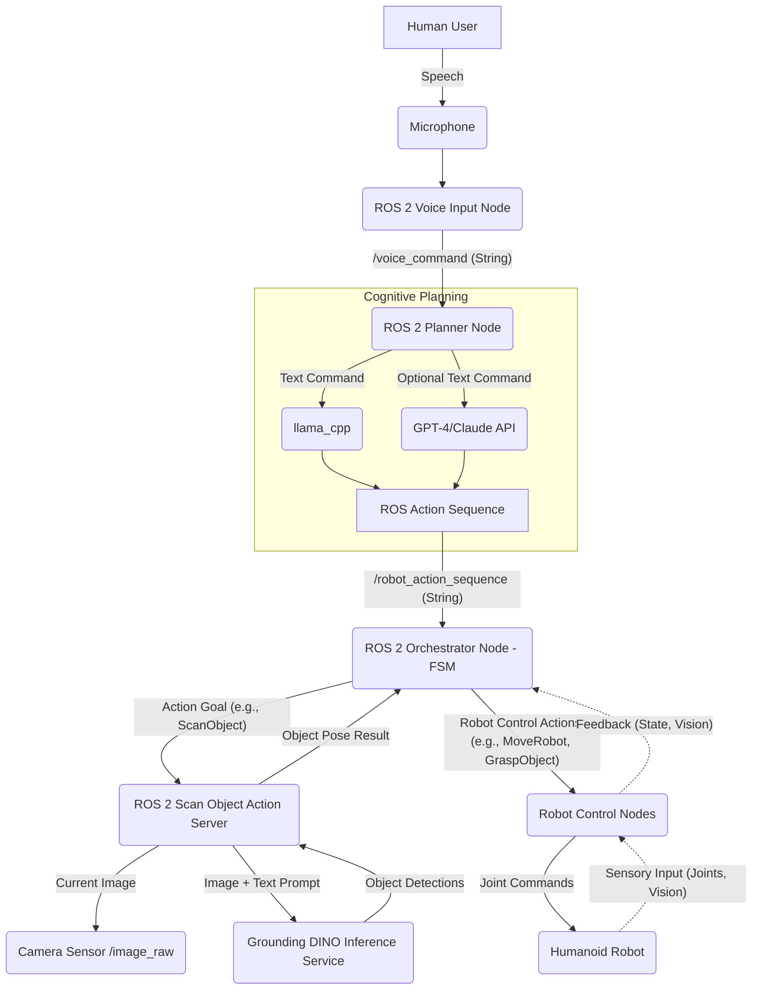

# Chapter 4.4: The Autonomous Humanoid Capstone Integration

This final chapter brings together all the components developed in Module 4 to create a fully autonomous humanoid robot system capable of understanding and executing complex commands. You will learn to build an "Orchestrator Node" that manages the flow from voice input to robot action, ensuring seamless integration and robust operation.

## 4.4.1 Orchestrator Node: The Brain of the VLA Pipeline

The Orchestrator Node acts as the central intelligence for our Vision-Language-Action (VLA) pipeline. Its primary role is to coordinate between the voice input, cognitive planning, and vision-language integration components, translating high-level goals into a sequence of low-level robot behaviors. This node is typically implemented as a finite state machine (FSM) to manage complex sequential tasks and handle various operational states and transitions.

### Finite State Machine (FSM) for the Orchestrator Node

An FSM is a mathematical model of computation. It is an abstract machine that can be in exactly one of a finite number of states at any given time. The FSM can change from one state to another in response to some external inputs; the change from one state to another is called a transition. A particular FSM is defined by a list of its states, its initial state, and the conditions for each transition.

Here's a simplified FSM (pseudocode or Mermaid JS) for our Orchestrator Node:

```mermaid
graph TD
    Start --> Idle;

    Idle -- Voice Command Received (/voice_command) --> ProcessingCommand;
    ProcessingCommand -- LLM Plan Generated (/robot_action_sequence) --> ExecutingPlan;
    ProcessingCommand -- LLM Error / No Plan --> Idle;

    ExecutingPlan -- Action Completed Successfully --> Idle;
    ExecutingPlan -- Action Requires Vision (e.g., "Find Object") --> ScanningForObject;
    ExecutingPlan -- Action Failed --> ErrorState;

    ScanningForObject -- Object Detected (scan_for_object result) --> ExecutingPlan;
    ScanningForObject -- Object Not Found / Vision Error --> ErrorState;

    ErrorState -- User Override / Reset --> Idle;
    ErrorState -- Unrecoverable Error --> Halt;
    
    Halt -- Manual Reset --> Idle;
```

*Figure 4.4.1: Orchestrator Node Finite State Machine*

**States**:
-   **Idle**: Robot is waiting for a new command.
-   **ProcessingCommand**: The LLM is actively processing a voice command to generate an action sequence.
-   **ExecutingPlan**: The robot is executing a sequence of actions determined by the LLM.
-   **ScanningForObject**: The robot is actively using its vision system to locate a specified object (e.g., via the `scan_for_object` action server).
-   **ErrorState**: An error has occurred (e.g., LLM generated invalid plan, object not found, action failed).
-   **Halt**: A critical, unrecoverable error has occurred, requiring manual intervention.

**Transitions**:
-   **Voice Command Received**: Triggers the transition from `Idle` to `ProcessingCommand`.
-   **LLM Plan Generated**: If the LLM successfully produces a plan, transition from `ProcessingCommand` to `ExecutingPlan`.
-   **LLM Error / No Plan**: If the LLM fails or doesn't generate an actionable plan, transition from `ProcessingCommand` back to `Idle` (possibly with a verbal feedback to the user).
-   **Action Completed Successfully**: Upon successful completion of an action, return to `Idle`.
-   **Action Requires Vision**: If an action (e.g., `grasp_object`) first requires locating an object, transition from `ExecutingPlan` to `ScanningForObject`.
-   **Object Detected**: Successful vision detection transitions to `ExecutingPlan` to proceed with the action.
-   **Object Not Found / Vision Error**: Failure to detect or a vision error transitions to `ErrorState`.
-   **Action Failed**: Any failure during action execution transitions to `ErrorState`.
-   **User Override / Reset**: A specific user command to clear errors and return to `Idle`.
-   **Unrecoverable Error**: Critical system failure leads to `Halt`.
-   **Manual Reset**: Physical reset to return from `Halt`.

### Implementing the Orchestrator Node

The Orchestrator Node will be a ROS 2 Python node that integrates the `rclpy` clients for topics and actions.

```python
import rclpy
from rclpy.node import Node
from std_msgs.msg import String
from rclpy.action import ActionClient
from rclpy.callback_groups import MutuallyExclusiveCallbackGroup, ReentrantCallbackGroup
from rclpy.executors import MultiThreadedExecutor
import threading
import time

# Import custom actions and services
from my_vla_planner_interfaces.action import ScanObject # From Chapter 4.3
# Assume more actions for robot movement, grasping, etc. (e.g., from a separate robot_control_interfaces package)
# from robot_control_interfaces.action import MoveRobot, GraspObject

# Define FSM states
class RobotState:
    IDLE = 0
    PROCESSING_COMMAND = 1
    EXECUTING_PLAN = 2
    SCANNING_FOR_OBJECT = 3
    ERROR_STATE = 4
    HALT = 5

class OrchestratorNode(Node):
    def __init__(self):
        super().__init__('orchestrator_node')
        self.get_logger().info('Orchestrator Node started.')

        # Callback groups for managing concurrency
        self.voice_sub_group = ReentrantCallbackGroup()
        self.planner_sub_group = ReentrantCallbackGroup()
        self.action_client_group = ReentrantCallbackGroup()

        # State variable
        self.current_state = RobotState.IDLE
        self.command_queue = [] # Queue for incoming voice commands

        # Subscriptions
        self.voice_subscription = self.create_subscription(
            String,
            'voice_command',
            self.voice_command_callback,
            10,
            callback_group=self.voice_sub_group)
        self.get_logger().info(f"Subscribing to {self.voice_subscription.topic}")

        self.planner_subscription = self.create_subscription(
            String,
            'robot_action_sequence',
            self.planner_callback,
            10,
            callback_group=self.planner_sub_group)
        self.get_logger().info(f"Subscribing to {self.planner_subscription.topic}")

        # Action clients
        self._scan_object_action_client = ActionClient(
            self,
            ScanObject,
            'scan_for_object',
            callback_group=self.action_client_group)
        self.get_logger().info("ScanObject action client created.")

        # Timers or other control mechanisms for FSM
        self.fsm_timer = self.create_timer(0.1, self.fsm_loop_callback) # Run FSM loop at 10 Hz

        # Variables to hold current goal handles/futures
        self._action_goal_handle = None
        self._planner_response = None
        self._vision_response = None
        self.active_action = None # To track which action is being executed

    def voice_command_callback(self, msg):
        self.get_logger().info(f"Orchestrator received voice command: {msg.data}")
        # Enqueue command for processing by FSM
        self.command_queue.append(msg.data)

    def planner_callback(self, msg):
        self.get_logger().info(f"Orchestrator received planner output: {msg.data}")
        self._planner_response = msg.data

    def fsm_loop_callback(self):
        # Implement state transitions based on self.current_state
        if self.current_state == RobotState.IDLE:
            if self.command_queue:
                command = self.command_queue.pop(0)
                self.get_logger().info(f"Transitioning to PROCESSING_COMMAND for: {command}")
                self.current_state = RobotState.PROCESSING_COMMAND
                # Publish to an internal topic or directly call a function that feeds to planner_node
                # For this example, we assume planner_node already subscribes to voice_command
                # and will respond via robot_action_sequence.
                # So we just wait for _planner_response to be set.
                self._planner_response = None # Clear previous response

        elif self.current_state == RobotState.PROCESSING_COMMAND:
            if self._planner_response:
                self.get_logger().info(f"Received plan from LLM: {self._planner_response}")
                if self._planner_response.startswith("TOOL_CALL:"):
                    self.active_action = self._planner_response
                    self.current_state = RobotState.EXECUTING_PLAN
                    self.get_logger().info("Transitioning to EXECUTING_PLAN.")
                else:
                    self.get_logger().info(f"LLM responded with natural language: {self._planner_response}")
                    self.current_state = RobotState.IDLE # Go back to idle if no actionable plan
                self._planner_response = None # Consume response
            # Add timeout logic here if planner is taking too long

        elif self.current_state == RobotState.EXECUTING_PLAN:
            if self.active_action:
                if "SCAN_FOR_OBJECT" in self.active_action: # Simplified check
                    self.get_logger().info(f"Action requires vision: {self.active_action}")
                    self.current_state = RobotState.SCANNING_FOR_OBJECT
                    self._vision_response = None
                    self._send_scan_object_goal(self.active_action.split(":")[-1].strip().replace(")", "")) # Extract description
                    self.active_action = None # Consumed
                else:
                    self.get_logger().info(f"Executing robot action: {self.active_action} (Simulated)")
                    # In a real robot, call actual action client here (e.g., MoveRobot, GraspObject)
                    # For now, simulate success
                    time.sleep(2) # Simulate action duration
                    self.get_logger().info("Simulated action completed.")
                    self.current_state = RobotState.IDLE
                    self.active_action = None
            else: # No active action, something went wrong or plan completed
                self.current_state = RobotState.IDLE
                self.get_logger().warn("ExecutingPlan state without active action. Returning to Idle.")

        elif self.current_state == RobotState.SCANNING_FOR_OBJECT:
            if self._vision_response:
                if self._vision_response['success']:
                    self.get_logger().info(f"Object detected at {self._vision_response['pose']}")
                    # Update active_action with pose or queue new action
                    # For simplicity, we'll just go back to executing plan with a dummy success
                    self.current_state = RobotState.EXECUTING_PLAN
                    self.active_action = "TOOL_CALL: grasp_object(x=..., y=..., z=..., object_name='detected')" # Placeholder
                else:
                    self.get_logger().error(f"Vision failed: {self._vision_response['message']}")
                    self.current_state = RobotState.ERROR_STATE
                self._vision_response = None
            # Add timeout logic here

        elif self.current_state == RobotState.ERROR_STATE:
            self.get_logger().error("Robot in ERROR_STATE. Manual reset or user override needed.")
            # self.current_state = RobotState.IDLE # Uncomment for auto-recovery (use with caution)

        elif self.current_state == RobotState.HALT:
            self.get_logger().fatal("Robot in HALT state. Manual intervention required.")
            # No transitions out of HALT without external manual trigger

    def _send_scan_object_goal(self, object_description):
        self.get_logger().info(f"Waiting for scan_for_object action server...")
        self._scan_object_action_client.wait_for_server()
        goal_msg = ScanObject.Goal()
        goal_msg.object_description = object_description
        self.get_logger().info(f"Sending goal to scan_for_object: {object_description}")

        self._action_goal_handle = self._scan_object_action_client.send_goal_async(goal_msg)
        self._action_goal_handle.add_done_callback(self._goal_response_callback)

    def _goal_response_callback(self, future):
        goal_handle = future.result()
        if not goal_handle.accepted:
            self.get_logger().error('ScanObject goal rejected :(')
            self._vision_response = {'success': False, 'message': 'Goal rejected'}
            return

        self.get_logger().info('ScanObject goal accepted :)')
        self._get_result_future = goal_handle.get_result_async()
        self._get_result_future.add_done_callback(self._get_result_callback)

    def _get_result_callback(self, future):
        result = future.result().result
        self.get_logger().info(f'ScanObject Result: Success={result.success}, Message="{result.message}"')
        self._vision_response = {'success': result.success, 'message': result.message, 'pose': result.object_pose}


def main(args=None):
    rclpy.init(args=args)
    # Use MultiThreadedExecutor to allow callbacks from subscriptions and action clients to run concurrently
    executor = MultiThreadedExecutor() 
    orchestrator_node = OrchestratorNode()
    executor.add_node(orchestrator_node)

    try:
        executor.spin()
    except KeyboardInterrupt:
        pass
    finally:
        orchestrator_node.destroy_node()
        rclpy.shutdown()

if __name__ == '__main__':
    main()
```

### Explanation of the Orchestrator Node

-   **State Management**: The `current_state` variable tracks the robot's FSM state. Transitions are handled in the `fsm_loop_callback`.
-   **Concurrency**: `MultiThreadedExecutor` is used to allow ROS 2 callbacks (from `voice_command`, `robot_action_sequence`, and action client responses) to run concurrently, preventing deadlock or blocking the FSM loop. `ReentrantCallbackGroup` ensures that callbacks can be executed on any available thread.
-   **ROS 2 Communication**:
    -   Subscribes to `/voice_command` (from `voice_input_node`).
    -   Subscribes to `/robot_action_sequence` (from `planner_node`).
    -   Acts as an `ActionClient` for `scan_for_object` (from `my_vla_vision` package).
    -   *(Implied)* Would act as `ActionClient` for `MoveRobot`, `GraspObject`, etc., interacting with the robot's motor control and manipulation systems.
-   **Simplified Action Execution**: For this example, actual robot actions like `move_robot` or `grasp_object` are simulated with `time.sleep()`. In a real system, these would involve proper ROS 2 Action Clients sending goals to specialized robot control nodes.

## 4.4.2 Comprehensive Data Flow Diagram

This diagram visualizes the complete VLA pipeline, from the user's voice command to the robot's physical execution.



*Figure 4.4.2: Comprehensive VLA Data Flow Diagram*

## 4.4.3 Master Launch File for the VLA System

A master ROS 2 launch file simplifies the deployment of the entire VLA pipeline. It allows you to start all necessary nodes and services with a single command.

Create `vla_system.launch.py` in a new package `vla_bringup` (e.g., `~/ros2_ws/src/vla_bringup/launch/`).

```python
import os
from ament_index_python.packages import get_package_share_directory
from launch import LaunchDescription
from launch_ros.actions import Node

def generate_launch_description():
    # Paths to your packages
    my_vla_voice_pkg_dir = get_package_share_directory('my_vla_voice')
    my_vla_planner_pkg_dir = get_package_share_directory('my_vla_planner')
    my_vla_vision_pkg_dir = get_package_share_directory('my_vla_vision') # Assuming you put ScanObject there

    return LaunchDescription([
        # 1. Voice Input Node
        Node(
            package='my_vla_voice',
            executable='voice_input_node',
            name='voice_input_node',
            output='screen',
            parameters=[{'whisper_model_size': 'small'}] # Example parameter
        ),

        # 2. Planner Node
        Node(
            package='my_vla_planner',
            executable='planner_node',
            name='planner_node',
            output='screen',
            parameters=[{'llm_model_path': '/home/your_user/ros2_ws/src/my_vla_planner/models/tinyllama-1.1b-chat-v1.0.Q4_K_M.gguf'}] # Example parameter
        ),

        # 3. Scan for Object Action Server
        Node(
            package='my_vla_vision',
            executable='scan_for_object_server',
            name='scan_for_object_action_server',
            output='screen',
            # parameters=[{'grounding_dino_api_url': 'http://localhost:8000/grounding_dino_infer'}] # Example parameter
        ),

        # 4. Camera Publisher (if using a webcam for demonstration)
        Node(
            package='image_tools',
            executable='cam2image',
            name='camera_publisher',
            output='screen',
            parameters=[{'frame_id': 'camera_link'}]
        ),
        
        # 5. Orchestrator Node
        Node(
            package='my_vla_orchestrator', # You'll need to create this package for the OrchestratorNode
            executable='orchestrator_node',
            name='orchestrator_node',
            output='screen',
        ),

        # Add other robot control nodes here (e.g., joint controllers, navigation stack)
    ])
```

*Note*: You'll need to create a new ROS 2 package (e.g., `my_vla_orchestrator`) for your `OrchestratorNode` and update its `setup.py` similar to previous chapters.

## 4.4.4 Troubleshooting & Optimization Guide

### Pipeline Works in Isolation but Breaks in Integration

-   **Problem**: Individual nodes (voice, planner, vision) function correctly on their own, but when launched together in the full VLA pipeline, the system fails or behaves unexpectedly.
-   **Solutions**:
    -   **ROS 2 Graph Inspection (`rqt_graph`)**: Use `rqt_graph` to visualize the ROS 2 computation graph. Verify that all nodes are running, connected as expected, and publishing/subscribing to the correct topics/actions. Look for disconnected nodes or incorrect topic names.
    -   **Topic/Action Data Inspection (`ros2 topic echo`, `ros2 action info`)**: Echo the topics and inspect action info (`ros2 action info <action_name>`) at various points in the pipeline to ensure data is flowing correctly and in the expected format.
    -   **Logger Levels**: Increase logging levels (e.g., `rclpy.logging.set_logger_level('orchestrator_node', rclpy.logging.DEBUG)`) for individual nodes to gain more insight into their internal state and decision-making processes.
    -   **State Machine Debugging**: Carefully trace the Orchestrator Node's FSM state transitions. Use print statements or dedicated logging within the FSM loop to understand why it might be stuck in a state or transitioning unexpectedly.
    -   **Resource Contention**: Multiple nodes running concurrently might contend for CPU, GPU, or memory resources, especially on the Jetson Orin. Monitor system resources (`htop`, `tegrastats` on Jetson) to identify bottlenecks.
    -   **Start Order**: Ensure nodes are started in a logical order (e.g., camera before vision server, voice before planner). ROS 2 launch files handle dependencies, but explicit `remappings` or `delay` parameters might be needed.

### Race Conditions or Timing Issues

-   **Problem**: The order of events or messages is not guaranteed, leading to inconsistent behavior (e.g., a planning node receives a command before the vision system has updated its object list).
-   **Solutions**:
    -   **ROS 2 Actions for Long-Running Tasks**: Use ROS 2 Actions (like `ScanObject`) for tasks with a clear start and end, and where the client needs to wait for a result. This inherently handles synchronization.
    -   **Message Filtering/Time Synchronization (`message_filters`)**: For topics that need to be processed together (e.g., image and its corresponding depth map, or command and robot state at the exact same time), use `message_filters` to synchronize their timestamps.
    -   **Stateful Orchestration**: The Orchestrator Node's FSM is key here. It explicitly manages the sequence of operations, waiting for conditions to be met (e.g., object detected) before proceeding.
    -   **Rate Limiting**: Implement rate limiting on publishers to prevent overwhelming downstream subscribers.
    -   **Timeouts**: Add timeouts to blocking operations (e.g., waiting for an action server, waiting for an LLM response) to prevent indefinite hangs.
    -   **Clear State Transitions**: Ensure that each state in the FSM has clear entry and exit conditions, and that transitions are atomic where possible.

## 4.4.5 Capstone Project: Autonomous Humanoid VLA Commander

**Objective**: Integrate all VLA components to enable a humanoid robot (simulated or physical) to understand and execute complex multi-step commands solely through voice.

**Deliverables**:
1.  A fully functional ROS 2 workspace containing all `my_vla_*` packages (voice, planner, vision, orchestrator), configured for your robot.
2.  The `vla_system.launch.py` master launch file, correctly bringing up all components.
3.  A video demonstration of your robot (simulated or physical) performing at least three distinct, multi-step tasks based on your spoken commands.

**Demonstration Tasks (Examples)**:
1.  **"Robot, please find the blue block and pick it up."**
    -   Robot should transition: `Idle` -> `ProcessingCommand` -> `ExecutingPlan` (to approach area) -> `ScanningForObject` (to find block) -> `ExecutingPlan` (to grasp) -> `Idle`.
2.  **"Robot, wave your left hand and then move forward half a meter."**
    -   Robot should execute a sequence of primitive actions.
3.  **"Robot, what is that red thing on the table?"**
    -   Robot should use its vision to identify the object and provide a verbal (or text) description.

**Evaluation Criteria**:
-   **Functionality**: Does the robot correctly interpret and execute the voice commands?
-   **Robustness**: How well does it handle variations in commands, minor ambiguities, or environmental changes?
-   **Integration**: Are all VLA pipeline components seamlessly integrated and communicating correctly?
-   **State Management**: Does the Orchestrator Node manage the robot's behavior logically and recover from simple errors?
-   **Clarity of Code/Configuration**: Is the implementation well-structured, documented, and easy to understand?

*(End of Chapter 4.4 and Module 4)*