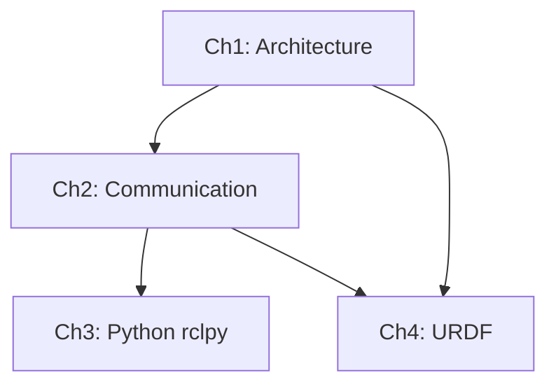

# Data Model: Module 1 Content Structure

**Feature**: 001-ros2-module
**Date**: 2025-12-16
**Phase**: Phase 1 - Design & Contracts

## Overview

This document defines the content structure, learning flow, and organizational entities for Module 1: The Robotic Nervous System (ROS 2). It serves as the blueprint for content creation, ensuring consistent organization and progressive learning.

---

## Entity Definitions

### 1. Module

**Entity**: Module
**Purpose**: Top-level organizational unit grouping related chapters

**Attributes**:
- `id`: Unique identifier (e.g., "module-1-ros2")
- `title`: Full title (e.g., "Module 1: The Robotic Nervous System (ROS 2)")
- `description`: Brief summary (2-3 sentences)
- `estimated_hours`: Expected completion time (8-12 hours)
- `prerequisites`: Required knowledge (Python basics, Linux CLI)
- `learning_outcomes`: What learners will achieve
- `chapters`: List of chapter IDs

**Example**:
```yaml
id: module-1-ros2
title: "Module 1: The Robotic Nervous System (ROS 2)"
description: "Foundational middleware layer for humanoid robotics using ROS 2. Covers architecture, communication patterns, Python implementation, and robot definition."
estimated_hours: 8-12
prerequisites: ["Python 3 basics", "Linux command line", "Ubuntu 22.04 with ROS 2 Humble"]
learning_outcomes:
  - "Explain ROS 2 architecture and middleware role"
  - "Design robot communication using topics, services, and actions"
  - "Implement Python robot agents with rclpy"
  - "Define humanoid robot structure with URDF"
chapters: ["ch1-architecture", "ch2-communication", "ch3-python-rclpy", "ch4-urdf"]
```

---

### 2. Chapter

**Entity**: Chapter
**Purpose**: Major learning unit focusing on one primary concept area

**Attributes**:
- `id`: Unique identifier (e.g., "ch1-architecture")
- `number`: Chapter number (1-4)
- `title`: Chapter title
- `directory`: File system path (e.g., "01-architecture")
- `estimated_hours`: Time to complete (2-3 hours)
- `learning_objectives`: Specific skills/knowledge gained
- `prerequisites`: Previous chapters or external knowledge
- `sections`: List of section IDs
- `code_examples`: List of code example IDs
- `diagrams`: List of diagram IDs
- `success_criteria`: How learners know they've mastered the chapter

**Example**:
```yaml
id: ch1-architecture
number: 1
title: "ROS 2 Architecture & Philosophy"
directory: "01-architecture"
estimated_hours: 2
learning_objectives:
  - "Explain the role of middleware in robotics systems"
  - "Describe ROS 2 architecture including nodes, DDS, and distributed communication"
  - "Compare ROS 1 and ROS 2 key differences"
  - "Run basic ROS 2 commands for system introspection"
prerequisites: ["Ubuntu 22.04 installed", "ROS 2 Humble installed"]
sections: ["middleware-role", "ros2-overview", "ros1-vs-ros2", "dds-explained", "getting-started"]
code_examples: []  # Chapter 1 is conceptual, commands only
diagrams: ["ros2-architecture", "dds-layers", "node-graph"]
success_criteria:
  - "Can explain middleware role in under 5 minutes"
  - "Can list 3+ ROS 1 vs ROS 2 differences"
  - "Successfully runs ros2 node list, ros2 topic list"
```

---

### 3. Section

**Entity**: Section
**Purpose**: Individual topic page within a chapter

**Attributes**:
- `id`: Unique identifier (e.g., "middleware-role")
- `title`: Section title
- `file_name`: MDX file name (e.g., "middleware-role.mdx")
- `sidebar_position`: Order in sidebar (1-based)
- `estimated_minutes`: Reading/practice time (10-30 min)
- `concepts_covered`: Key concepts introduced
- `commands`: Shell commands demonstrated (if any)
- `code_examples`: Code examples shown (if any)
- `diagrams`: Visual aids included
- `admonitions`: Special callouts (notes, warnings, tips)
- `exercises`: Practice activities

**Example**:
```yaml
id: middleware-role
title: "The Role of Middleware in Robotics"
file_name: "middleware-role.mdx"
sidebar_position: 1
estimated_minutes: 15
concepts_covered: ["middleware definition", "robot complexity", "communication abstraction", "why ROS 2"]
commands: []  # Conceptual section
code_examples: []
diagrams: ["robot-subsystems", "middleware-layer"]
admonitions:
  - type: "note"
    content: "Middleware acts like the nervous system of a robot, coordinating communication between subsystems."
exercises:
  - "List three robot subsystems that need to communicate"
  - "Explain in your own words what middleware provides"
```

---

### 4. Code Example

**Entity**: Code Example
**Purpose**: Executable code demonstrating a concept

**Attributes**:
- `id`: Unique identifier (e.g., "simple-publisher")
- `name`: Descriptive name
- `type`: Example type (publisher | subscriber | service | action | urdf | launch | full-system)
- `language`: Programming language (python | xml | bash)
- `directory`: Location in examples/ (e.g., "examples/module-1/simple_publisher")
- `files`: List of files with roles
- `ros2_components`: ROS 2 elements used (nodes, topics, services, actions, message types)
- `description`: What the example demonstrates
- `prerequisites`: What must be set up first
- `execution_steps`: How to build and run
- `expected_output`: What successful execution looks like
- `verification_commands`: How to confirm it's working
- `common_errors`: Known issues and solutions

**Example**:
```yaml
id: simple-publisher
name: "Simple Publisher Node"
type: publisher
language: python
directory: "examples/module-1/simple_publisher"
files:
  - path: "simple_publisher/__init__.py"
    role: "Package marker"
  - path: "simple_publisher/publisher_node.py"
    role: "Main publisher implementation"
  - path: "package.xml"
    role: "ROS 2 package metadata"
  - path: "setup.py"
    role: "Python package setup"
ros2_components:
  nodes: ["minimal_publisher"]
  topics: ["/hello_topic"]
  message_types: ["std_msgs/String"]
  qos: ["default (depth 10)"]
description: "Publishes string messages to a topic at 2Hz, demonstrating basic pub/sub pattern"
prerequisites: ["ROS 2 Humble sourced", "Workspace created"]
execution_steps:
  - "Navigate to workspace: cd ~/ros2_ws"
  - "Build package: colcon build --packages-select simple_publisher"
  - "Source workspace: source install/setup.bash"
  - "Run node: ros2 run simple_publisher publisher_node"
expected_output: |
  [INFO] [minimal_publisher]: Publishing: "Hello World: 0"
  [INFO] [minimal_publisher]: Publishing: "Hello World: 1"
  ...
verification_commands:
  - "ros2 node list  # Should show /minimal_publisher"
  - "ros2 topic list  # Should show /hello_topic"
  - "ros2 topic echo /hello_topic  # Shows messages"
common_errors:
  - error: "Package not found"
    solution: "Ensure colcon build succeeded and workspace is sourced"
  - error: "Command not found"
    solution: "Source ROS 2 setup: source /opt/ros/humble/setup.bash"
```

---

### 5. Diagram

**Entity**: Diagram
**Purpose**: Visual representation of architecture, flow, or structure

**Attributes**:
- `id`: Unique identifier (e.g., "ros2-architecture")
- `title`: Diagram title
- `file_name`: File name (e.g., "ros2-architecture.svg")
- `format`: Image format (svg | png | mermaid)
- `purpose`: What the diagram illustrates
- `elements`: Key components shown
- `used_in_sections`: Sections that reference this diagram

**Example**:
```yaml
id: ros2-architecture
title: "ROS 2 Layered Architecture"
file_name: "ros2-architecture.svg"
format: svg
purpose: "Illustrate the layered architecture from application layer to DDS middleware to OS/network"
elements:
  - "Application layer (nodes)"
  - "ROS 2 client library (rclpy/rclcpp)"
  - "ROS 2 middleware interface (rmw)"
  - "DDS implementation (e.g., Fast DDS)"
  - "OS and network layer"
used_in_sections: ["ros2-overview", "dds-explained"]
```

---

## Learning Flow Design

### Progressive Complexity Model

The module follows a deliberate progression from abstract to concrete, from understanding to implementation:

```
Phase 1: Understanding (Chapter 1)
  └─> What is ROS 2? Why does it exist? How does it work?

Phase 2: Design (Chapter 2)
  └─> How do I architect communication? What patterns exist?

Phase 3: Implementation (Chapter 3)
  └─> How do I write code? How do I build working nodes?

Phase 4: Definition (Chapter 4)
  └─> How do I model robots? How do I define structure?
```

### Knowledge Dependencies



**Interpretation**:
- Chapter 1 is prerequisite for all others (foundational concepts)
- Chapter 2 is prerequisite for Chapter 3 (design before implementation)
- Chapters 3 and 4 are independent (can be learned in either order after 1-2)

### Concept Introduction Strategy

**Chapter 1** introduces:
- Node (abstract concept)
- Topic (abstract concept)
- DDS (background technology)
- ROS 2 vs ROS 1 (context)

**Chapter 2** deepens:
- Topic (detailed patterns, QoS)
- Service (new primitive)
- Action (new primitive)
- Computation graph (system view)

**Chapter 3** implements:
- Node (Python class)
- Topic (create_publisher, create_subscription)
- Service (create_service, create_client)
- Action (action server, action client)

**Chapter 4** applies:
- Links (robot structure)
- Joints (robot kinematics)
- Frames (coordinate systems)
- URDF (robot definition language)

**Design Principle**: Each concept is introduced abstractly, explored in detail, then implemented practically.

---

## Content Structure Map

### Module 1: The Robotic Nervous System (ROS 2)

#### Chapter 1: ROS 2 Architecture & Philosophy
- **01-architecture/index.mdx** - Chapter introduction
- **01-architecture/middleware-role.mdx** - What middleware does
- **01-architecture/ros2-overview.mdx** - ROS 2 architecture layers
- **01-architecture/ros1-vs-ros2.mdx** - Comparison and evolution
- **01-architecture/dds-explained.mdx** - DDS middleware layer
- **01-architecture/getting-started.mdx** - Installation and basic commands

**Page Estimates**: 6 pages, ~12-15 pages equivalent
**Code Examples**: 0 (conceptual + commands)
**Diagrams**: 4 (architecture, DDS layers, node graph, ROS 1 vs 2 comparison)

---

#### Chapter 2: Communication Primitives
- **02-communication/index.mdx** - Chapter introduction
- **02-communication/topics-pubsub.mdx** - Publish/subscribe pattern
- **02-communication/services-reqrep.mdx** - Request/response pattern
- **02-communication/actions-goals.mdx** - Action servers and clients
- **02-communication/qos-profiles.mdx** - Quality of Service configuration
- **02-communication/executors.mdx** - Callback execution models
- **02-communication/graph-design.mdx** - Designing computation graphs

**Page Estimates**: 7 pages, ~14-18 pages equivalent
**Code Examples**: 0 (conceptual, CLI demonstrations)
**Diagrams**: 5 (pub/sub flow, service flow, action flow, QoS scenarios, computation graph)

---

#### Chapter 3: Python Implementation with rclpy
- **03-python-rclpy/index.mdx** - Chapter introduction
- **03-python-rclpy/rclpy-overview.mdx** - rclpy API structure
- **03-python-rclpy/package-setup.mdx** - Creating ROS 2 Python packages
- **03-python-rclpy/publisher-node.mdx** - Implementing publishers
- **03-python-rclpy/subscriber-node.mdx** - Implementing subscribers
- **03-python-rclpy/service-impl.mdx** - Service servers and clients
- **03-python-rclpy/action-impl.mdx** - Action servers and clients
- **03-python-rclpy/custom-msgs.mdx** - Custom message/service/action types
- **03-python-rclpy/parameters.mdx** - Parameter handling
- **03-python-rclpy/best-practices.mdx** - Code organization patterns
- **03-python-rclpy/complete-example.mdx** - Full multi-node system

**Page Estimates**: 11 pages, ~22-28 pages equivalent
**Code Examples**: 6 (publisher, subscriber, service, action, custom messages, multi-node system)
**Diagrams**: 3 (package structure, node lifecycle, multi-node architecture)

---

#### Chapter 4: URDF for Humanoid Robots
- **04-urdf/index.mdx** - Chapter introduction
- **04-urdf/urdf-syntax.mdx** - URDF XML structure
- **04-urdf/frames-transforms.mdx** - Coordinate frames and TF
- **04-urdf/links-properties.mdx** - Link definitions (visual, collision, inertial)
- **04-urdf/joints-types.mdx** - Joint types and constraints
- **04-urdf/humanoid-example.mdx** - Complete humanoid URDF
- **04-urdf/rviz-viz.mdx** - Visualizing in RViz
- **04-urdf/sensors-urdf.mdx** - Adding sensors to URDF
- **04-urdf/validation.mdx** - URDF validation and best practices

**Page Estimates**: 9 pages, ~18-22 pages equivalent
**Code Examples**: 2 (simplified humanoid URDF, launch file for visualization)
**Diagrams**: 4 (TF tree, link hierarchy, humanoid structure, sensor placement)

---

### Content Totals

- **Total Pages**: 33 MDX files
- **Estimated Page Equivalent**: 66-83 pages
- **Total Code Examples**: 8 complete examples
- **Total Diagrams**: 16 visual aids
- **Estimated Reading Time**: 8-12 hours (matches spec)

---

## Relationships

### Chapter → Sections
Each chapter contains multiple sections (pages), accessed via hierarchical navigation.

### Section → Code Examples
Sections reference code examples, which live in separate `examples/` directory for independent execution.

### Section → Diagrams
Sections embed diagrams stored in `static/img/module-1/`.

### Code Example → Message Types
Code examples use standard ROS 2 message types (`std_msgs`, `geometry_msgs`, etc.) or custom types defined in example packages.

### URDF → Launch Files
URDF examples are accompanied by launch files for visualization in RViz.

---

## Validation Rules

### Chapter Completeness
- ✅ Every chapter has an index page with learning objectives
- ✅ Every chapter has 5-11 sections
- ✅ Every chapter ends with summary section (in index or final page)
- ✅ Every chapter references at least one diagram
- ✅ Chapters 3-4 include runnable code examples

### Section Consistency
- ✅ Every section has clear title and sidebar position
- ✅ Every section builds on previous sections (no forward dependencies)
- ✅ Commands shown in sections include expected output
- ✅ Technical terms defined on first use

### Code Example Quality
- ✅ Every example has complete file listing
- ✅ Every example has execution steps
- ✅ Every example has verification commands
- ✅ Every example addresses common errors
- ✅ Examples follow ROS 2 naming conventions

### Learning Flow Integrity
- ✅ No concept used before introduction
- ✅ Difficulty increases progressively
- ✅ Prerequisites clearly stated
- ✅ Success criteria measurable

---

## Next Steps

With this data model defined:
1. Create detailed chapter contracts in `contracts/` directory
2. Specify each code example's implementation details
3. Define diagram specifications
4. Create `quickstart.md` for rapid reference
5. Prepare for task generation (`/sp.tasks`)

---

**Document Status**: Complete ✅
**Entities Defined**: 5 (Module, Chapter, Section, Code Example, Diagram)
**Learning Flow Validated**: Yes
**Ready for Contract Creation**: Yes
