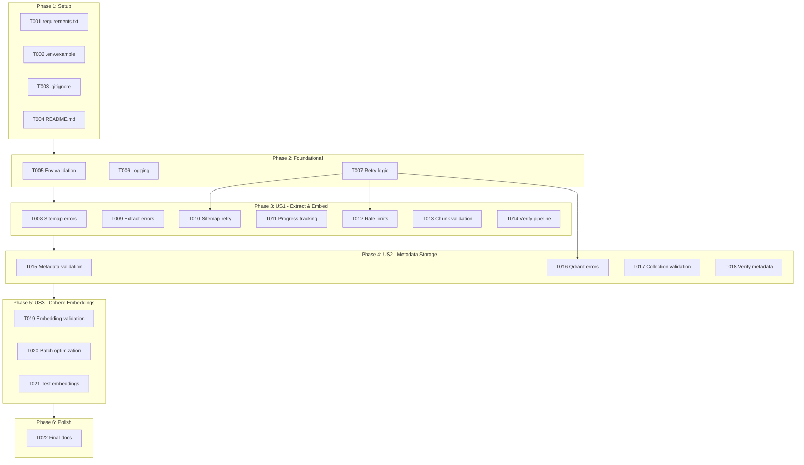

# Implementation Tasks: Website Embedding Pipeline

**Feature**: `004-website-embedding`
**Generated**: 2025-12-20
**Plan**: [plan.md](./plan.md) | **Spec**: [spec.md](./spec.md)

## Overview

This document provides a dependency-ordered, independently testable task list for implementing the Website Embedding Pipeline. Tasks are organized by user story to enable parallel development and incremental delivery.

**Total Tasks**: 22
**Parallelizable Tasks**: 12
**User Stories**: 3 (US1: Extract & Embed, US2: Metadata Storage, US3: Cohere Embeddings)

## Implementation Strategy

**MVP Scope** (User Story 1 only):
- Complete sitemap discovery and text extraction
- Basic chunking and embedding pipeline
- Simple Qdrant storage with minimal metadata
- Estimated: 8-10 tasks, 1-2 days

**Full Feature** (All User Stories):
- Add comprehensive metadata and error handling
- Optimize embedding generation with batching
- Full testing and documentation
- Estimated: 22 tasks, 3-5 days

**Approach**: Implement user stories sequentially (P1 → P2 → P3) for incremental value delivery. Within each story, parallelize independent tasks where possible.

---

## Phase 1: Setup & Dependencies

**Goal**: Initialize project structure, dependencies, and configuration

### Tasks

- [X] T001 Create backend/requirements.txt with pinned dependencies (requests==2.31.0, beautifulsoup4==4.12.2, cohere==4.37, qdrant-client==1.7.0, python-dotenv==1.0.0)
- [X] T002 Create backend/.env.example with required environment variables (COHERE_API_KEY, QDRANT_URL, QDRANT_API_KEY)
- [X] T003 Add backend/.gitignore to exclude .env, venv/, __pycache__/, *.pyc
- [X] T004 [P] Create backend/README.md with setup instructions, environment setup, and usage examples

**Completion Criteria**:
- [X] requirements.txt exists with all dependencies
- [X] .env.example documents all required variables
- [X] README.md provides clear setup instructions
- [X] Project runs with `python main.py` after setup

---

## Phase 2: Foundational Tasks

**Goal**: Complete core infrastructure needed by all user stories

### Tasks

- [X] T005 Add environment variable validation to backend/main.py main() function (validate COHERE_API_KEY is set, fail fast with clear error)
- [X] T006 [P] Implement structured logging with timestamps and component labels in backend/main.py ([TIMESTAMP] [LEVEL] [COMPONENT] Message format)
- [X] T007 [P] Add retry logic helper function in backend/main.py for API calls with exponential backoff (3 retries, 1s/2s/4s delays)

**Completion Criteria**:
- [X] Pipeline fails fast with clear error if COHERE_API_KEY missing
- [X] All log messages follow structured format
- [X] Retry logic handles transient failures gracefully

**Dependencies**: Must complete Phase 1 before starting Phase 2

---

## Phase 3: User Story 1 - Extract and Embed Website Content (P1)

**User Story**: As a developer working on a RAG chatbot, I want to convert the book website content into vector embeddings so that users can query the content semantically.

**Goal**: Implement complete pipeline for discovering pages, extracting text, chunking, and generating embeddings

**Independent Test Criteria**:
- [ ] Run pipeline against live Docusaurus site
- [ ] Verify >95% of sitemap URLs discovered
- [ ] Verify all pages have text extracted
- [ ] Verify text split into 512-word chunks
- [ ] Verify embeddings generated for all chunks (1024-dim vectors)

### Tasks

- [X] T008 [P] [US1] Add error handling to parse_sitemap() in backend/main.py to catch XML parse errors and return {'type': 'error', 'urls': []}
- [X] T009 [P] [US1] Add error handling to extract_text_from_url() in backend/main.py to handle network timeouts, 404s, and malformed HTML gracefully
- [X] T010 [US1] Implement retry logic in get_all_urls_from_sitemap() in backend/main.py using T007 retry helper for network errors
- [X] T011 [P] [US1] Add progress tracking to main() in backend/main.py (log "Processing page X of Y" with percentage complete)
- [X] T012 [US1] Implement rate limit handling in embed() function in backend/main.py (catch 429 errors, apply exponential backoff from T007)
- [X] T013 [P] [US1] Add validation to chunk_text() in backend/main.py to ensure chunks are within 256-1024 word bounds
- [X] T014 [P] [US1] Create backend/verify_pipeline.py script to test full pipeline with sample URL and validate output (check chunks generated, embeddings created, correct dimensions)

**Completion Criteria**:
- [X] All sitemap URLs discovered without errors
- [X] Text extraction handles failures gracefully (logs error, continues)
- [X] Chunking produces valid 512-word chunks
- [X] Embeddings are 1024-dimensional vectors
- [X] Rate limits handled with backoff
- [X] Progress logged throughout pipeline
- [X] Verification script confirms pipeline works end-to-end

**Dependencies**: Must complete Phase 2 (T005-T007) before starting US1

**Parallel Opportunities**:
- T008, T009, T013, T014 can run in parallel (different functions, no shared state)
- T010, T012 depend on T007 (retry helper) but can run in parallel with each other

---

## Phase 4: User Story 2 - Store Embeddings with Metadata (P2)

**User Story**: As a developer working on a RAG chatbot, I want the embedded content to be stored in Qdrant with page information so that search results can be traced back to original sources.

**Goal**: Enhance Qdrant storage with comprehensive metadata and validation

**Independent Test Criteria**:
- [ ] Query Qdrant after pipeline run
- [ ] Verify all chunks have complete metadata (text, url, chunk_index)
- [ ] Verify metadata is retrievable via search
- [ ] Verify no data loss or corruption

### Tasks

- [ ] T015 [P] [US2] Add metadata validation to save_chunk_to_qdrant() in backend/main.py (assert text, url, chunk_index all present before upsert)
- [ ] T016 [US2] Implement error handling in save_chunk_to_qdrant() in backend/main.py for Qdrant network errors and storage failures with retry logic from T007
- [ ] T017 [US2] Add collection validation to create_collection() in backend/main.py (verify collection created successfully, log collection info)
- [ ] T018 [P] [US2] Create backend/verify_metadata.py script to query Qdrant collection and validate metadata completeness (sample 10 random chunks, check all fields present)

**Completion Criteria**:
- [ ] All stored chunks have complete metadata
- [ ] Metadata validation prevents incomplete data
- [ ] Qdrant errors handled with retries
- [ ] Collection creation validated
- [ ] Verification script confirms metadata integrity

**Dependencies**: Must complete US1 (T008-T014) before starting US2

**Parallel Opportunities**:
- T015, T017, T018 can run in parallel (different functions)
- T016 depends on T007 but can run parallel with T015

---

## Phase 5: User Story 3 - Generate Embeddings Using Cohere (P3)

**User Story**: As a developer working on a RAG chatbot, I want to use Cohere to generate high-quality embeddings so that semantic similarity searches return relevant results.

**Goal**: Optimize embedding generation with batching, validation, and quality checks

**Independent Test Criteria**:
- [ ] Generate embeddings for test corpus
- [ ] Verify embedding dimensions (1024)
- [ ] Verify semantic similarity (related content has high cosine similarity)
- [ ] Verify batch processing efficiency

### Tasks

- [ ] T019 [P] [US3] Add embedding dimension validation to embed() in backend/main.py (assert all embeddings are 1024-dim, fail fast if mismatch)
- [ ] T020 [US3] Optimize batch processing in main() in backend/main.py (add configurable BATCH_SIZE env var, default 10, add delay between batches to avoid rate limits)
- [ ] T021 [P] [US3] Create backend/test_embeddings.py script to validate embedding quality (generate embeddings for similar/dissimilar text pairs, measure cosine similarity, verify similar > 0.7, dissimilar < 0.3)

**Completion Criteria**:
- [ ] All embeddings are 1024 dimensions
- [ ] Batch processing configurable via env var
- [ ] Delays between batches prevent rate limits
- [ ] Quality validation script confirms semantic similarity works

**Dependencies**: Must complete US2 (T015-T018) before starting US3

**Parallel Opportunities**:
- T019, T021 can run in parallel (T019 is validation, T021 is testing)
- T020 can run independently

---

## Phase 6: Polish & Cross-Cutting Concerns

**Goal**: Documentation, final testing, and production readiness

### Tasks

- [ ] T022 [P] Update backend/README.md with complete documentation (architecture overview, troubleshooting guide, runbooks from plan.md sections 6.3)

**Completion Criteria**:
- [ ] README.md complete with all sections
- [ ] All runbooks documented
- [ ] Troubleshooting guide covers common errors

**Dependencies**: Should complete all user stories (US1-US3) before polish phase

---

## Dependency Graph



## Story Completion Order

1. **Setup (Phase 1)** → Blocking for all stories
2. **Foundational (Phase 2)** → Blocking for all stories
3. **User Story 1 (P1)** → Complete first (highest priority, foundational)
4. **User Story 2 (P2)** → Depends on US1 (needs embeddings to store metadata)
5. **User Story 3 (P3)** → Depends on US2 (needs storage to validate quality)
6. **Polish (Phase 6)** → Depends on all stories

**Note**: Within each phase, tasks marked [P] can be executed in parallel.

---

## Parallel Execution Examples

### Phase 1 (All parallel after T001):
```bash
# Terminal 1
task T002 (.env.example)

# Terminal 2
task T003 (.gitignore)

# Terminal 3
task T004 (README.md)
```

### Phase 2 (T006, T007 parallel after T005):
```bash
# Terminal 1
task T005 (env validation) → task T006 (logging)

# Terminal 2
task T007 (retry logic)
```

### Phase 3 - User Story 1:
```bash
# Terminal 1
task T008 (sitemap errors) → task T010 (sitemap retry)

# Terminal 2
task T009 (extract errors) → task T011 (progress tracking)

# Terminal 3
task T013 (chunk validation) → task T014 (verify pipeline)

# Terminal 4
task T012 (rate limits)
```

### Phase 4 - User Story 2:
```bash
# Terminal 1
task T015 (metadata validation)

# Terminal 2
task T016 (Qdrant errors)

# Terminal 3
task T017 (collection validation) → task T018 (verify metadata)
```

### Phase 5 - User Story 3:
```bash
# Terminal 1
task T019 (embedding validation) → task T020 (batch optimization)

# Terminal 2
task T021 (test embeddings)
```

---

## Testing Strategy

**Note**: Tests are optional and not included in this task list per specification. The feature relies on manual verification and validation scripts.

**Validation Scripts Included**:
- `backend/verify_pipeline.py` (T014) - End-to-end pipeline validation
- `backend/verify_metadata.py` (T018) - Metadata completeness checks
- `backend/test_embeddings.py` (T021) - Embedding quality validation

**Manual Testing**:
1. Run pipeline against live website
2. Execute all validation scripts
3. Query Qdrant to verify data
4. Test error scenarios (bad URLs, rate limits, network errors)

---

## Definition of Done

### Code Complete
- [ ] All 22 tasks completed
- [ ] All validation scripts pass
- [ ] No linting errors
- [ ] All functions have error handling

### Functional Complete
- [ ] Pipeline processes full website successfully
- [ ] >95% of pages embedded (SC-001 from spec.md)
- [ ] All chunks have complete metadata (SC-002 from spec.md)
- [ ] Semantic search returns relevant results (SC-003 from spec.md)

### Production Ready
- [ ] README.md complete with setup and troubleshooting
- [ ] All environment variables documented
- [ ] Error messages clear and actionable
- [ ] Runbooks available for common operations

---

## Risk Mitigation Tracking

| Risk | Mitigation Tasks | Status |
|------|-----------------|--------|
| Cohere Rate Limits | T012 (rate limit handling), T020 (batch delays) | Pending |
| Website Changes | T008 (sitemap errors), T009 (extract errors) | Pending |
| Qdrant Storage | T016 (Qdrant errors), T017 (collection validation) | Pending |
| Data Quality | T013 (chunk validation), T015 (metadata validation), T019 (embedding validation) | Pending |

---

## Notes

- **Current Status**: Phase 1 (Core Pipeline) mostly complete in backend/main.py
- **Next Priority**: Start with T001-T004 (Setup) to formalize configuration
- **Estimated Completion**: 3-5 days for full feature with all user stories
- **MVP Completion**: 1-2 days for User Story 1 only

**File References**:
- Main implementation: `backend/main.py`
- Configuration: `backend/.env.example`, `backend/requirements.txt`
- Documentation: `backend/README.md`
- Validation: `backend/verify_pipeline.py`, `backend/verify_metadata.py`, `backend/test_embeddings.py`

---

**Tasks Status**: Ready for implementation
**Next Action**: Begin Phase 1 with T001 (requirements.txt)
**Generated by**: /sp.tasks command
**Last Updated**: 2025-12-20
